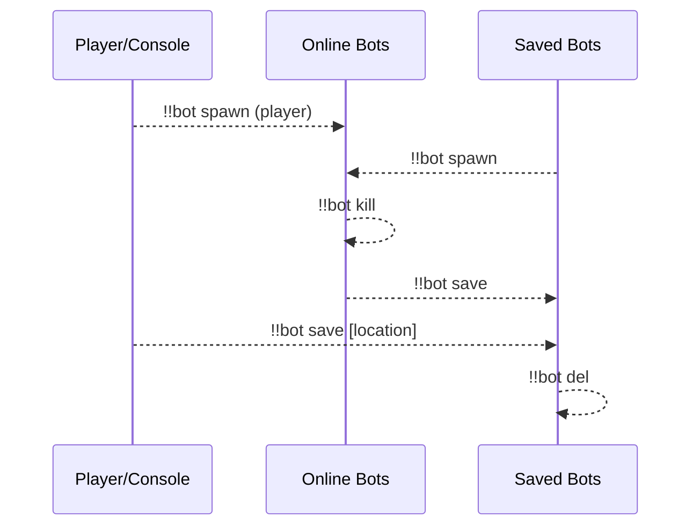
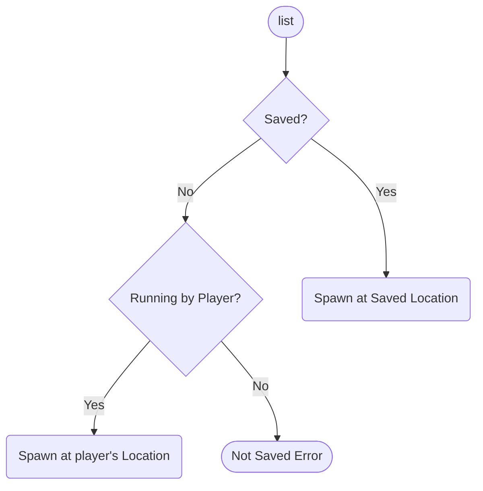
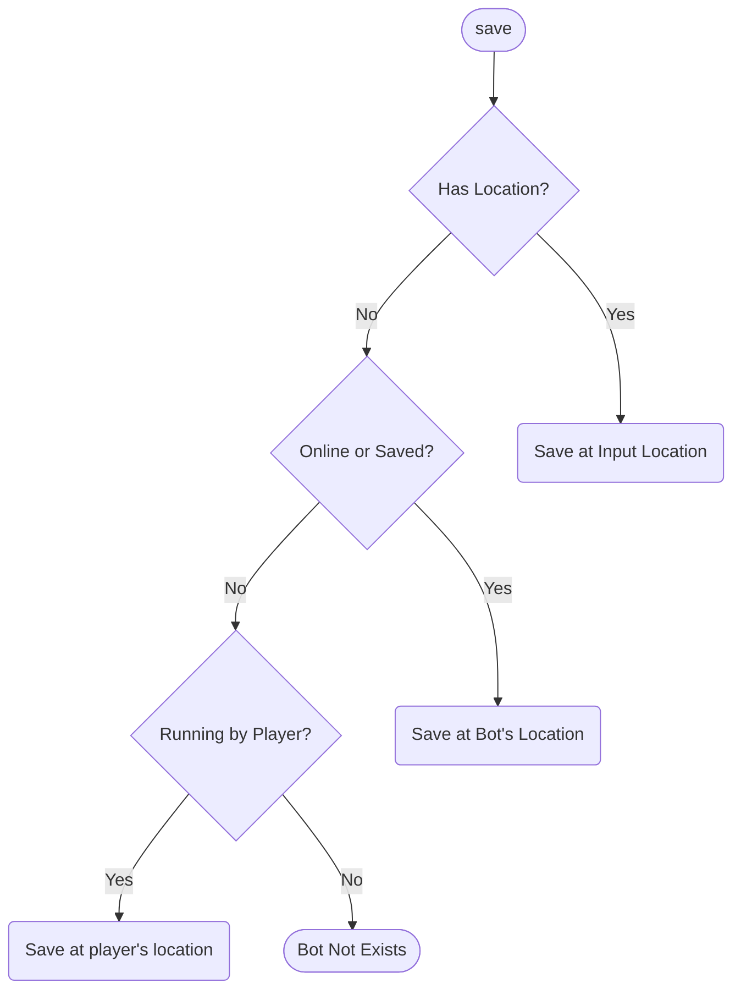
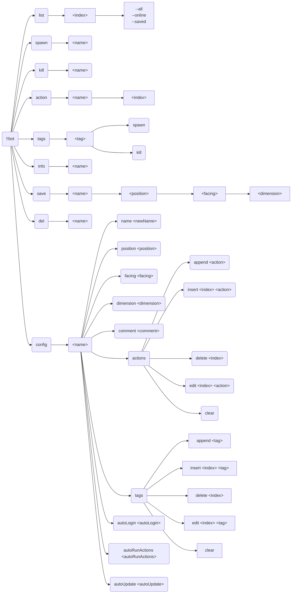
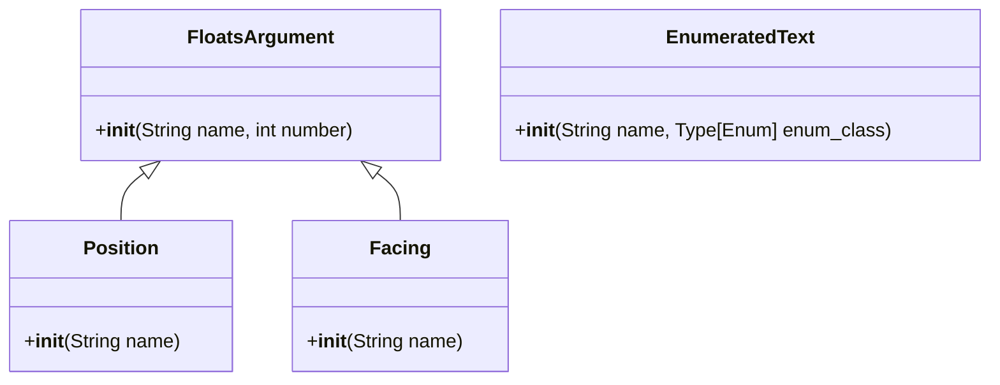

**English** | [中文](full-zh_cn.md)

\>\>\> [Back to index](/readme.md)

# Full Plugin Information Collection

Use `ctrl-f` to performance an in-page search, for what you are interested in

## advanced_calculator

### Basic Information

- Plugin ID: `advanced_calculator`
- Plugin Name: AdvancedCalculator
- Version: None
  - Metadata version: 0.3.1
  - Release version: None
- Total downloads: 0
- Authors: [Andy Zhang](https://github.com/AnzhiZhang)
- Repository: https://github.com/AnzhiZhang/MCDReforgedPlugins
- Repository plugin page: https://github.com/AnzhiZhang/MCDReforgedPlugins/tree/master/advanced_calculator
- Labels: [`Tool`](/labels/tool/readme.md)
- Description: Provides multiple convenient in-game calculations

### Dependencies

| Plugin ID | Requirement |
| --- | --- |

### Requirements

| Python package | Requirement |
| --- | --- |

### Introduction

# AdvancedCalculator

> 提供游戏内多种便捷计算

## 使用

您可以使用 `=<expression>` 直接计算表达式，或使用 `==<count/expression>` 将物品数转换堆叠数。

| 指令 | 用途 | 示例 | 结果 |
| - | - | - | - |
| !!calc \<expression> | 计算表达式 | !!calc 1+1 | 1+1=2 |
| !!calc item \<count/expression> | 物品数转换堆叠数 | !!calc item 1794 | 1794个物品为1盒2组3个 |
| !!calc item \<box> \<stack> \<single> | 堆叠数转换物品数 | !!calc item 1 10 32 | 1盒10组32个为2400个物品 |
| !!calc color \<red> \<green> \<blue> | 10进制RGB转16进制 | !!calc color 255 0 255 | (255, 0, 255) -> #FF00FF |
| !!calc color \<#HEX> | 16十进制RGB转10进制 | !!calc color #00FF00 | #00FF00 -> (0, 255, 0) |

### Download

> :warning: Warning: Read the README file in plugin repository before using it.

| File | Version | Upload Time | Size | Downloads | Operations |
| --- | --- | --- | --- | --- | --- |

## advanced_whitelist_r

### Basic Information

- Plugin ID: `advanced_whitelist_r`
- Plugin Name: AdvancedWhitelistR
- Version: None
  - Metadata version: 1.0.3
  - Release version: None
- Total downloads: 0
- Authors: [noionion](https://github.com/2X-ercha), [GamerNoTitle](https://github.com/GamerNoTitle)
- Repository: https://github.com/EMUnion/AdvancedWhitelistR
- Repository plugin page: https://github.com/EMUnion/AdvancedWhitelistR/tree/master
- Labels: [`Management`](/labels/management/readme.md)
- Description: For outline-model Whitelist

### Dependencies

| Plugin ID | Requirement |
| --- | --- |
| [mcdreforged](https://github.com/Fallen-Breath/MCDReforged) | \>=2.1.0 |

### Requirements

| Python package | Requirement |
| --- | --- |

### Introduction

Offline server whitelist management

### Download

> :warning: Warning: Read the README file in plugin repository before using it.

| File | Version | Upload Time | Size | Downloads | Operations |
| --- | --- | --- | --- | --- | --- |

## allow_suicide

### Basic Information

- Plugin ID: `allow_suicide`
- Plugin Name: allow_suicide
- Version: None
  - Metadata version: 1.0.0
  - Release version: None
- Total downloads: 0
- Authors: [JAs0n](https://github.com/JAs0n319)
- Repository: https://github.com/JAs0n319/allow_suicide
- Repository plugin page: https://github.com/JAs0n319/allow_suicide/tree/master
- Labels: [`Tool`](/labels/tool/readme.md)
- Description: allow player suicide with no op

### Dependencies

| Plugin ID | Requirement |
| --- | --- |
| [mcdreforged](https://github.com/Fallen-Breath/MCDReforged) | \>=2.1.0 |

### Requirements

| Python package | Requirement |
| --- | --- |

### Introduction

Allow player suicide without op
### Download

> :warning: Warning: Read the README file in plugin repository before using it.

| File | Version | Upload Time | Size | Downloads | Operations |
| --- | --- | --- | --- | --- | --- |

## auto_command

### Basic Information

- Plugin ID: `auto_command`
- Plugin Name: Auto Command
- Version: None
  - Metadata version: 1.3.0
  - Release version: None
- Total downloads: 0
- Authors: [bzyyyyyyyy](https://github.com/bzyyyyyyyy)
- Repository: https://github.com/bzyyyyyyyy/MCDR-AutoCommand
- Repository plugin page: https://github.com/bzyyyyyyyy/MCDR-AutoCommand/tree/master
- Labels: [`Tool`](/labels/tool/readme.md)
- Description: A plugin that send send commands automaticly

### Dependencies

| Plugin ID | Requirement |
| --- | --- |
| [mcdreforged](https://github.com/Fallen-Breath/MCDReforged) | \>=2.1.0 |
| [minecraft_data_api](/plugins/minecraft_data_api/readme.md) | * |

### Requirements

| Python package | Requirement |
| --- | --- |
| [mcdreforged](https://pypi.org/project/mcdreforged) | \>=2.1.0 |

### Introduction

Edit/send command stack & automatically send commands
### Download

> :warning: Warning: Read the README file in plugin repository before using it.

| File | Version | Upload Time | Size | Downloads | Operations |
| --- | --- | --- | --- | --- | --- |

## auto_plugin_reloader

### Basic Information

- Plugin ID: `auto_plugin_reloader`
- Plugin Name: Auto Plugin Reloader
- Version: None
  - Metadata version: 1.1.3
  - Release version: None
- Total downloads: 0
- Authors: [Fallen_Breath](https://github.com/Fallen-Breath)
- Repository: https://github.com/TISUnion/AutoPluginReloader
- Repository plugin page: https://github.com/TISUnion/AutoPluginReloader/tree/master
- Labels: [`Management`](/labels/management/readme.md)
- Description: Automatically reload plugins when file changes

### Dependencies

| Plugin ID | Requirement |
| --- | --- |
| [mcdreforged](https://github.com/Fallen-Breath/MCDReforged) | \>=2.1.0-beta |

### Requirements

| Python package | Requirement |
| --- | --- |

### Introduction

It's a plugin that automatically detects changes made in the MCDR plugin folders and triggers plugin reload

It's a savior for lazy people who are tired of having to manually perform plugin reloads after plugin file updates!

### Download

> :warning: Warning: Read the README file in plugin repository before using it.

| File | Version | Upload Time | Size | Downloads | Operations |
| --- | --- | --- | --- | --- | --- |

## beep

### Basic Information

- Plugin ID: `beep`
- Plugin Name: Beep
- Version: None
  - Metadata version: 1.1.0
  - Release version: None
- Total downloads: 0
- Authors: [Fallen_Breath](https://github.com/Fallen-Breath), [LucunJi](https://github.com/LucunJi)
- Repository: https://github.com/TISUnion/Beep
- Repository plugin page: https://github.com/TISUnion/Beep/tree/master
- Labels: [`Tool`](/labels/tool/readme.md)
- Description: Use @ \<someone\> to ping someone, @ all for everyone. Use @@ for a pogger ping

### Dependencies

| Plugin ID | Requirement |
| --- | --- |
| [mcdreforged](https://github.com/Fallen-Breath/MCDReforged) | \>=2.1.0 |

### Requirements

| Python package | Requirement |
| --- | --- |

### Introduction

*None*

### Download

> :warning: Warning: Read the README file in plugin repository before using it.

| File | Version | Upload Time | Size | Downloads | Operations |
| --- | --- | --- | --- | --- | --- |

## bingo

### Basic Information

- Plugin ID: `bingo`
- Plugin Name: Bingo
- Version: None
  - Metadata version: 0.0.3
  - Release version: None
- Total downloads: 0
- Authors: [Andy Zhang](https://github.com/AnzhiZhang)
- Repository: https://github.com/AnzhiZhang/MCDReforgedPlugins
- Repository plugin page: https://github.com/AnzhiZhang/MCDReforgedPlugins/tree/master/bingo
- Labels: [`Tool`](/labels/tool/readme.md)
- Description: Useful tool for Bingo game

### Dependencies

| Plugin ID | Requirement |
| --- | --- |

### Requirements

| Python package | Requirement |
| --- | --- |

### Introduction

# Bingo

> [Bingo](https://www.flytre.net/bingo) 游戏实用工具

## 使用

| 指令 | 用途 |
| - | - |
| !!bingo team \<num> | 随机分组 |
| !!bingo end | 结束游戏 |

### Download

> :warning: Warning: Read the README file in plugin repository before using it.

| File | Version | Upload Time | Size | Downloads | Operations |
| --- | --- | --- | --- | --- | --- |

## bot

### Basic Information

- Plugin ID: `bot`
- Plugin Name: Bot
- Version: None
  - Metadata version: 1.1.1
  - Release version: None
- Total downloads: 0
- Authors: [Andy Zhang](https://github.com/AnzhiZhang)
- Repository: https://github.com/AnzhiZhang/MCDReforgedPlugins
- Repository plugin page: https://github.com/AnzhiZhang/MCDReforgedPlugins/tree/master/bot
- Labels: [`Tool`](/labels/tool/readme.md), [`Management`](/labels/management/readme.md)
- Description: The best carpet bot manager!

### Dependencies

| Plugin ID | Requirement |
| --- | --- |
| [mcdreforged](https://github.com/Fallen-Breath/MCDReforged) | ^2.6.0 |
| [minecraft_data_api](/plugins/minecraft_data_api/readme.md) | ^1.4 |
| [more_command_nodes](/plugins/more_command_nodes/readme.md) | ^1.1.0 |

### Requirements

| Python package | Requirement |
| --- | --- |

### Introduction

# Bot

[简体中文](https://github.com/AnzhiZhang/MCDReforgedPlugins/blob/master/bot/readme_cn.md)

> The best carpet bot manager!

## Dependencies

- [MinecraftDataAPI](https://github.com/MCDReforged/MinecraftDataAPI)
- [MoreCommandNodes](https://github.com/AnzhiZhang/MCDReforgedPlugins/tree/master/more_command_nodes)

## Usage

`!!bot` View help

`!!bot list [index] [filter]` Show bot list

`!!bot spawn <name>` Spawn bot

`!!bot kill <name>` Kill bot

`!!bot action <name> [index]` Execute bot action(s)

`!!bot tags` View available tags

`!!bot tags <tag> spawn/kill` Spawn/kill bot(s) with tag

`!!bot info <name>` View bot info

`!!bot save <name> [position] [facing] [dimension]` Save bot

`!!bot del <name>` Delete saved bot

`!!bot config <name> <option> <value>` Config bot

### Workflow



### list

**index**: Page number of the list

**filter**: Available options are: `--all`, `--online` or `--saved`, filter bots

### spawn

Spawn bot



### kill

Kill bot

### action

Execute bot action(s)

When `index` is specified, execute specific action(s) instead of all actions

### tags

View available tags and spawn/kill bot(s) with tag

`!!bot tags` View available tags

`!!bot tags <tag> spawn` Spawn bot(s) with tag

`!!bot tags <tag> kill` Kill bot(s) with tag

### info

View bot info

### save

Save bot



### del

Delete saved bot

### config

Config bot

### Full Command Tree



## Config

### gamemode

Default: `survival`

Game mode of bot

### name_prefix

Default: `bot_`

Prefix of bot name

### name_suffix

Default: None

Suffix of bot name

### permissions

Minimum permission to use corresponding command

## FastAPI MCDR

This plugin supports [FastAPI MCDR](https://github.com/AnzhiZhang/MCDReforgedPlugins/tree/master/fastapi_mcdr) plugin, please refer to the source code for detailed API, or run and view the FastAPI document via `http://127.0.0.1:8080/docs`.

### Download

> :warning: Warning: Read the README file in plugin repository before using it.

| File | Version | Upload Time | Size | Downloads | Operations |
| --- | --- | --- | --- | --- | --- |

## bot_plugin

### Basic Information

- Plugin ID: `bot_plugin`
- Plugin Name: Bot Plugin
- Version: None
  - Metadata version: 1.1.0
  - Release version: None
- Total downloads: 0
- Authors: [DancingSnow0517](https://github.com/DancingSnow0517)
- Repository: https://github.com/DancingSnow0517/Bot_Manager
- Repository plugin page: https://github.com/DancingSnow0517/Bot_Manager/tree/master
- Labels: [`Management`](/labels/management/readme.md), [`Tool`](/labels/tool/readme.md)
- Description: 管理 carpet 机器人

### Dependencies

| Plugin ID | Requirement |
| --- | --- |
| [mcdreforged](https://github.com/Fallen-Breath/MCDReforged) | \>=2.3.0 |
| [minecraft_data_api](/plugins/minecraft_data_api/readme.md) | \>=1.4.0 |

### Requirements

| Python package | Requirement |
| --- | --- |

### Introduction

# A MCDR bot manager。

:warning: **Read README in repository before use!**
### Download

> :warning: Warning: Read the README file in plugin repository before using it.

| File | Version | Upload Time | Size | Downloads | Operations |
| --- | --- | --- | --- | --- | --- |

## carpet_bot_manager

### Basic Information

- Plugin ID: `carpet_bot_manager`
- Plugin Name: Carpet Bot Manager
- Version: None
  - Metadata version: 0.3.5
  - Release version: None
- Total downloads: 0
- Authors: [YehowahLiu](https://github.com/YehowahLiu)
- Repository: https://github.com/FAS-Server/CarpetBotManager
- Repository plugin page: https://github.com/FAS-Server/CarpetBotManager/tree/main
- Labels: [`Tool`](/labels/tool/readme.md)
- Description: A carpet bot manage plugin, able to spawn bot and make it execute actions

### Dependencies

| Plugin ID | Requirement |
| --- | --- |
| [mcdreforged](https://github.com/Fallen-Breath/MCDReforged) | \>=2.6.0 |
| [minecraft_data_api](/plugins/minecraft_data_api/readme.md) | \>=1.4.0 |

### Requirements

| Python package | Requirement |
| --- | --- |
| [mcdreforged](https://pypi.org/project/mcdreforged) | \>=2.6.0 |

### Introduction

A carpet bot manage plugin, able to spawn bot and make it execute actions

### Download

> :warning: Warning: Read the README file in plugin repository before using it.

| File | Version | Upload Time | Size | Downloads | Operations |
| --- | --- | --- | --- | --- | --- |

## carpet_tick

### Basic Information

- Plugin ID: `carpet_tick`
- Plugin Name: Carpet Tick
- Version: None
  - Metadata version: 1.1.1
  - Release version: None
- Total downloads: 0
- Authors: [Ivan1F](https://github.com/Ivan-1F)
- Repository: https://github.com/Ivan-1F/CarpetTick
- Repository plugin page: https://github.com/Ivan-1F/CarpetTick/tree/master
- Labels: [`Information`](/labels/information/readme.md)
- Description: Get server status using carpet /tick command

### Dependencies

| Plugin ID | Requirement |
| --- | --- |
| [mcdreforged](https://github.com/Fallen-Breath/MCDReforged) | \>=2.1.0-beta |

### Requirements

| Python package | Requirement |
| --- | --- |

### Introduction

*None*

### Download

> :warning: Warning: Read the README file in plugin repository before using it.

| File | Version | Upload Time | Size | Downloads | Operations |
| --- | --- | --- | --- | --- | --- |

## carpetbotlist

### Basic Information

- Plugin ID: `carpetbotlist`
- Plugin Name: CarpetBotList
- Version: None
  - Metadata version: 2.1.1
  - Release version: None
- Total downloads: 0
- Authors: [ZeroKelvin](https://github.com/BelowZeroKelvin)
- Repository: https://github.com/BelowZeroKelvin/MCDR-CarpetBotList
- Repository plugin page: https://github.com/BelowZeroKelvin/MCDR-CarpetBotList/tree/MCDR-2.x
- Labels: [`Tool`](/labels/tool/readme.md)
- Description: Help you manage your carpet fake player

### Dependencies

| Plugin ID | Requirement |
| --- | --- |
| [mcdreforged](https://github.com/Fallen-Breath/MCDReforged) | ^2.0.0-beta.1 |
| [minecraft_data_api](/plugins/minecraft_data_api/readme.md) | * |

### Requirements

| Python package | Requirement |
| --- | --- |

### Introduction

Help you manage your carpet fake player

### Download

> :warning: Warning: Read the README file in plugin repository before using it.

| File | Version | Upload Time | Size | Downloads | Operations |
| --- | --- | --- | --- | --- | --- |

## cato

### Basic Information

- Plugin ID: `cato`
- Plugin Name: Cato Plugin
- Version: None
  - Metadata version: 1.1.0
  - Release version: None
- Total downloads: 0
- Authors: [Harry-zklcdc](https://github.com/Harry-zklcdc)
- Repository: https://github.com/Harry-zklcdc/MCDR-Cato
- Repository plugin page: https://github.com/Harry-zklcdc/MCDR-Cato/tree/main
- Labels: [`Tool`](/labels/tool/readme.md)
- Description: Plugin Cato

### Dependencies

| Plugin ID | Requirement |
| --- | --- |
| [mcdreforged](https://github.com/Fallen-Breath/MCDReforged) | \>=2.0.0-alpha.1 |

### Requirements

| Python package | Requirement |
| --- | --- |

### Introduction

When the server starts, it automatically uses Cato (P2P connection tool) for port mapping, and supports the generation of HMCL Multiplayer code

# Features:

- Cato official support
- Non inductive P2P connection
- HMCL Multiplayer Support
- Cato crash / temporary ID expires restart automatically
- API interface to obtain Cato connection ID and HMCL Multiplayer code
- Cato token hot replacement
- Get Cato connection ID and HMCL Multiplayer code in the game

### Download

> :warning: Warning: Read the README file in plugin repository before using it.

| File | Version | Upload Time | Size | Downloads | Operations |
| --- | --- | --- | --- | --- | --- |

## chatbridge

### Basic Information

- Plugin ID: `chatbridge`
- Plugin Name: ChatBridge v2 for MCDR
- Version: None
  - Metadata version: 2.5.3
  - Release version: None
- Total downloads: 0
- Authors: [Fallen_Breath](https://github.com/Fallen-Breath)
- Repository: https://github.com/TISUnion/ChatBridge
- Repository plugin page: https://github.com/TISUnion/ChatBridge/tree/master
- Labels: [`Tool`](/labels/tool/readme.md)
- Description: Broadcast chats between Minecraft servers and more

### Dependencies

| Plugin ID | Requirement |
| --- | --- |
| [mcdreforged](https://github.com/Fallen-Breath/MCDReforged) | \>=2.2.0- |

### Requirements

| Python package | Requirement |
| --- | --- |
| [mcdreforged](https://pypi.org/project/mcdreforged) | \>=2.2.0 |
| [pycryptodome](https://pypi.org/project/pycryptodome) |  |
| [colorlog](https://pypi.org/project/colorlog) |  |

### Introduction

Chatbridge v2

### Download

> :warning: Warning: Read the README file in plugin repository before using it.

| File | Version | Upload Time | Size | Downloads | Operations |
| --- | --- | --- | --- | --- | --- |

## chatbridgereforged_mc

### Basic Information

- Plugin ID: `chatbridgereforged_mc`
- Plugin Name: ChatBridgeReforged_MC
- Version: None
  - Metadata version: 0.2.7-dev032
  - Release version: None
- Total downloads: 0
- Authors: [Ricky](https://github.com/R1ckyH)
- Repository: https://github.com/R1ckyH/ChatBridgeReforged
- Repository plugin page: https://github.com/R1ckyH/ChatBridgeReforged/tree/master/./ChatBridgeReforged_MC
- Labels: [`Tool`](/labels/tool/readme.md)
- Description: Reforged of ChatBridge, interaction with other clients(such as minecraft server, discord bots or other custom clients).

### Dependencies

| Plugin ID | Requirement |
| --- | --- |
| [mcdreforged](https://github.com/Fallen-Breath/MCDReforged) | \>=2.0.0 |

### Requirements

| Python package | Requirement |
| --- | --- |
| [mcdreforged](https://pypi.org/project/mcdreforged) |  |
| [pycryptodomex](https://pypi.org/project/pycryptodomex) |  |

### Introduction

Reforged of ChatBridge, interaction with other clients(such as minecraft server, discord bot or other things).

### Download

> :warning: Warning: Read the README file in plugin repository before using it.

| File | Version | Upload Time | Size | Downloads | Operations |
| --- | --- | --- | --- | --- | --- |

## colored_chat

### Basic Information

- Plugin ID: `colored_chat`
- Plugin Name: ColoredChat
- Version: None
  - Metadata version: 0.0.3
  - Release version: None
- Total downloads: 0
- Authors: [Andy Zhang](https://github.com/AnzhiZhang)
- Repository: https://github.com/AnzhiZhang/MCDReforgedPlugins
- Repository plugin page: https://github.com/AnzhiZhang/MCDReforgedPlugins/tree/master/.archived/ColoredChat
- Labels: [`Tool`](/labels/tool/readme.md)
- Description: Support formatting codes for vanilla

### Dependencies

| Plugin ID | Requirement |
| --- | --- |

### Requirements

| Python package | Requirement |
| --- | --- |

### Introduction

# ColoredChat

> 支持原版显示 [格式化代码](https://minecraft.fandom.com/zh/wiki/%E6%A0%BC%E5%BC%8F%E5%8C%96%E4%BB%A3%E7%A0%81)

## 使用

与正常聊天没有区别, 需要格式化时使用 `&` 符号

## 配置

`force_refresh`

是否刷新聊天栏的所有内容, 某些无法被记录的信息可能会被覆盖

默认值: `True`

## API

可以使用 `append_msg(msg)` 方法来插件的广播消息

### Download

> :warning: Warning: Read the README file in plugin repository before using it.

| File | Version | Upload Time | Size | Downloads | Operations |
| --- | --- | --- | --- | --- | --- |

## command_exporter

### Basic Information

- Plugin ID: `command_exporter`
- Plugin Name: MCDR Command Exporter
- Version: None
  - Metadata version: 1.2.0
  - Release version: None
- Total downloads: 0
- Authors: [DancingSnow](https://github.com/DancingSnow0517)
- Repository: https://github.com/DancingSnow0517/MCDR-Command-Exporter
- Repository plugin page: https://github.com/DancingSnow0517/MCDR-Command-Exporter/tree/master/command_exporter
- Labels: [`Tool`](/labels/tool/readme.md)
- Description: A plugin is used to export the MCDR command tree

### Dependencies

| Plugin ID | Requirement |
| --- | --- |
| [mcdreforged](https://github.com/Fallen-Breath/MCDReforged) | \>=2.7.0 |

### Requirements

| Python package | Requirement |
| --- | --- |

### Introduction

English | [中文](README-CN.MD)

# MCDR Command Exporter

A plugin is used to export the MCDR command tree.

Get client completion with mod [MCDR-Completion](https://github.com/DancingSnow0517/MCDR-Completion).

## Usage
1. Go to [release page](https://github.com/DancingSnow0517/MCDR-Command-Exporter/releases) download `MCDRCommandExporter-vX.X.X.mcdr` plugin

   Put it in the plugins folder and reload MCDR plugins.

2. Download fabric mod [MCDR-Completion](https://github.com/DancingSnow0517/MCDR-Completion/releases) and install it to `Server` and `Client`

   This mod requires [fabric-api](https://modrinth.com/mod/fabric-api)

3. Join the server and enjoy it! 


### Download

> :warning: Warning: Read the README file in plugin repository before using it.

| File | Version | Upload Time | Size | Downloads | Operations |
| --- | --- | --- | --- | --- | --- |

## cpu_temp

### Basic Information

- Plugin ID: `cpu_temp`
- Plugin Name: cpu_temp
- Version: None
  - Metadata version: 3.0.2
  - Release version: None
- Total downloads: 0
- Authors: [Ricky](https://github.com/R1ckyH)
- Repository: https://github.com/R1ckyH/cpu_temp
- Repository plugin page: https://github.com/R1ckyH/cpu_temp/tree/master
- Labels: [`Information`](/labels/information/readme.md)
- Description: A plugin to check cpu temp regularly.

### Dependencies

| Plugin ID | Requirement |
| --- | --- |
| [mcdreforged](https://github.com/Fallen-Breath/MCDReforged) | \>=2.0.0 |

### Requirements

| Python package | Requirement |
| --- | --- |
| [psutil](https://pypi.org/project/psutil) |  |
| [mcdreforged](https://pypi.org/project/mcdreforged) |  |
| [APScheduler](https://pypi.org/project/APScheduler) |  |

### Introduction

A plugin to check cpu temp regularly.

### Download

> :warning: Warning: Read the README file in plugin repository before using it.

| File | Version | Upload Time | Size | Downloads | Operations |
| --- | --- | --- | --- | --- | --- |

## crash_restart

### Basic Information

- Plugin ID: `crash_restart`
- Plugin Name: Crash Restart
- Version: None
  - Metadata version: 1.0.0
  - Release version: None
- Total downloads: 0
- Authors: [Fallen_Breath](https://github.com/Fallen-Breath)
- Repository: https://github.com/MCDReforged/CrashRestart
- Repository plugin page: https://github.com/MCDReforged/CrashRestart/tree/master
- Labels: [`Tool`](/labels/tool/readme.md)
- Description: Automatically restart the server after the server crashed

### Dependencies

| Plugin ID | Requirement |
| --- | --- |

### Requirements

| Python package | Requirement |
| --- | --- |

### Introduction

*None*

### Download

> :warning: Warning: Read the README file in plugin repository before using it.

| File | Version | Upload Time | Size | Downloads | Operations |
| --- | --- | --- | --- | --- | --- |

## database_api

### Basic Information

- Plugin ID: `database_api`
- Plugin Name: DatabaseAPI
- Version: None
  - Metadata version: 0.1.1
  - Release version: None
- Total downloads: 0
- Authors: [Andy Zhang](https://github.com/AnzhiZhang)
- Repository: https://github.com/AnzhiZhang/MCDReforgedPlugins
- Repository plugin page: https://github.com/AnzhiZhang/MCDReforgedPlugins/tree/master/database_api
- Labels: [`API`](/labels/api/readme.md)
- Description: Database API to access database

### Dependencies

| Plugin ID | Requirement |
| --- | --- |

### Requirements

| Python package | Requirement |
| --- | --- |
| [sqlalchemy](https://pypi.org/project/sqlalchemy) |  |

### Introduction

# DatabaseAPI

> 数据库API
>
> 提供了数据库操作的便捷API

## 环境要求

### Python包

- sqlalchemy

## 开发文档

查看 [Valut](https://github.com/AnzhiZhang/MCDReforgedPlugins/tree/master/.archived/vault/vault.py) 参考使用方法

提供了以下两个类:

- TableBase
- DataManager

### TableBase

一个数据库表的基类, 写一个你的数据库表并继承这个类来创建一张表

### DataManager

使用本API需要自行实例化这个类

实例化: `__init__(self, file_path: str)`

#### get_session

获取一个数据库会话的上下文管理器, 更多信息请自行查找资料

### Download

> :warning: Warning: Read the README file in plugin repository before using it.

| File | Version | Upload Time | Size | Downloads | Operations |
| --- | --- | --- | --- | --- | --- |

## daycount_nbt

### Basic Information

- Plugin ID: `daycount_nbt`
- Plugin Name: DayCount NBT
- Version: None
  - Metadata version: 2.2.1
  - Release version: None
- Total downloads: 0
- Authors: [Alex3236](https://github.com/alex3236)
- Repository: https://github.com/alex3236/daycount-NBT
- Repository plugin page: https://github.com/alex3236/daycount-NBT/tree/main/src
- Labels: [`Information`](/labels/information/readme.md), [`API`](/labels/api/readme.md)
- Description: :calendar: Get and export server opening times.

### Dependencies

| Plugin ID | Requirement |
| --- | --- |
| [mcdreforged](https://github.com/Fallen-Breath/MCDReforged) | \>=2.2.0 |

### Requirements

| Python package | Requirement |
| --- | --- |

### Introduction

Get and export server opening times.

Feature:
- NBT Mode

:warning: **Read README in repository before use!**
### Download

> :warning: Warning: Read the README file in plugin repository before using it.

| File | Version | Upload Time | Size | Downloads | Operations |
| --- | --- | --- | --- | --- | --- |

## daytime

### Basic Information

- Plugin ID: `daytime`
- Plugin Name: Daytime
- Version: None
  - Metadata version: 1.1.0
  - Release version: None
- Total downloads: 0
- Authors: [ZeroKelvin](https://github.com/BelowZeroKelvin)
- Repository: https://github.com/BelowZeroKelvin/MCDR-Daytime
- Repository plugin page: https://github.com/BelowZeroKelvin/MCDR-Daytime/tree/MCDR-2.x
- Labels: [`Tool`](/labels/tool/readme.md)
- Description: show time in minecraft

### Dependencies

| Plugin ID | Requirement |
| --- | --- |
| [mcdreforged](https://github.com/Fallen-Breath/MCDReforged) | ^2.0.0-beta.1 |

### Requirements

| Python package | Requirement |
| --- | --- |

### Introduction

Show time in Minecraft

### Download

> :warning: Warning: Read the README file in plugin repository before using it.

| File | Version | Upload Time | Size | Downloads | Operations |
| --- | --- | --- | --- | --- | --- |

## delayexe

### Basic Information

- Plugin ID: `delayexe`
- Plugin Name: Delay Exe
- Version: None
  - Metadata version: 1.3.2
  - Release version: None
- Total downloads: 0
- Authors: [zyxkad](https://github.com/zyxkad)
- Repository: https://github.com/kmcsr/delayexe_mcdr
- Repository plugin page: https://github.com/kmcsr/delayexe_mcdr/tree/master
- Labels: [`Tool`](/labels/tool/readme.md), [`API`](/labels/api/readme.md)
- Description: Delay execute command until all player have left

### Dependencies

| Plugin ID | Requirement |
| --- | --- |
| [mcdreforged](https://github.com/Fallen-Breath/MCDReforged) | \>=2.0.0 |
| [kpi](/plugins/kpi/readme.md) | ~1.4.6 |

### Requirements

| Python package | Requirement |
| --- | --- |

### Introduction

*None*

### Download

> :warning: Warning: Read the README file in plugin repository before using it.

| File | Version | Upload Time | Size | Downloads | Operations |
| --- | --- | --- | --- | --- | --- |

## diamond_calc

### Basic Information

- Plugin ID: `diamond_calc`
- Plugin Name: Diamond Calculator
- Version: None
  - Metadata version: 1.0.0
  - Release version: None
- Total downloads: 0
- Authors: [Huaji_MUR233](https://github.com/HuajiMUR233)
- Repository: https://github.com/HuajiMUR233/DiamondCalc
- Repository plugin page: https://github.com/HuajiMUR233/DiamondCalc/tree/master
- Labels: [`Tool`](/labels/tool/readme.md)
- Description: *None*

### Dependencies

| Plugin ID | Requirement |
| --- | --- |

### Requirements

| Python package | Requirement |
| --- | --- |

### Introduction

*None*

### Download

> :warning: Warning: Read the README file in plugin repository before using it.

| File | Version | Upload Time | Size | Downloads | Operations |
| --- | --- | --- | --- | --- | --- |

## dict_command_registration

### Basic Information

- Plugin ID: `dict_command_registration`
- Plugin Name: Dict Command Registration
- Version: None
  - Metadata version: 1.1.0
  - Release version: None
- Total downloads: 0
- Authors: [Andy Zhang](https://github.com/AnzhiZhang)
- Repository: https://github.com/AnzhiZhang/MCDReforgedPlugins
- Repository plugin page: https://github.com/AnzhiZhang/MCDReforgedPlugins/tree/master/dict_command_registration
- Labels: [`API`](/labels/api/readme.md)
- Description: Register your command by a python dict

### Dependencies

| Plugin ID | Requirement |
| --- | --- |
| [mcdreforged](https://github.com/Fallen-Breath/MCDReforged) | ^2.7.0 |

### Requirements

| Python package | Requirement |
| --- | --- |

### Introduction

# Dict Command Registration

> Register your command with a python dict.

MCDReforged implements a command system like [brigadier](https://github.com/Mojang/brigadier), but it is too difficult to use and not intuitive enough. When the tree becomes large, maintainability and readability become extremely poor. Then you have to split it into multiple child nodes, but when the child nodes become large you need to keep splitting them and end up in an infinite loop.

This plugin provides an API that allows you to register MCDR command trees with python dict, which is also a tree structure - a more intuitive structure, isn't it? It takes the python dict you provide, generates the MCDR Command Node, then register it. You do not have to bother with the huge code tree, just maintain your dict tree.

Incidentally, it can register the [help message](https://mcdreforged.readthedocs.io/en/latest/code_references/PluginServerInterface.html#mcdreforged.plugin.server_interface.PluginServerInterface.register_help_message) for you.

## Quick Start

Let's register this example command in MCDR doc:

```text
Literal('!!email'). \
then(Literal('list')). \
then(Literal('remove'). \
    then(Integer('email_id'))
). \
then(Literal('send'). \
    then(Text('player'). \
        then(GreedyText('message'))
    )
)
```

Write the command dict and call register method.

```python
from dict_command_registration import NodeType, register

command = {
    "name": "!!email",
    "children": [
        {
            "name": "list"
        },
        {
            "name": "remove",
            "children": [
                {
                    "name": "email_id",
                    "type": NodeType.INTEGER
                }
            ]
        },
        {
            "name": "send",
            "children": [
                {
                    "name": "player",
                    "type": NodeType.TEXT,
                    "children": [
                        {
                            "name": "email_id",
                            "type": NodeType.GREEDY_TEXT
                        }
                    ]
                }
            ]
        }
    ]
}

def on_load(server, prev_module):
    register(server, command)
```

All done!

If you want register help message together:

```python
register(server, command, "Email command")
```

## Concepts

### Node

In this plugin, `Node` means a dict which contains data of a MCDR
command node.

See also: [Node](#node-dict)

## API Reference

### Exceptions

#### MissingRequiredAttribute

Raise when missing required attribute in [Node](#node-dict).

### NodeType

MCDR Origin Command Nodes.

| Key | Class |
| - | - |
| LITERAL | [Literal](https://mcdreforged.readthedocs.io/en/latest/code_references/command.html#mcdreforged.command.builder.nodes.basic.Literal) |
| NUMBER | [Number](https://mcdreforged.readthedocs.io/en/latest/code_references/command.html#mcdreforged.command.builder.nodes.arguments.Number) |
| INTEGER | [Integer](https://mcdreforged.readthedocs.io/en/latest/code_references/command.html#mcdreforged.command.builder.nodes.arguments.Integer) |
| FLOAT | [Float](https://mcdreforged.readthedocs.io/en/latest/code_references/command.html#mcdreforged.command.builder.nodes.arguments.Float) |
| TEXT | [Text](https://mcdreforged.readthedocs.io/en/latest/code_references/command.html#mcdreforged.command.builder.nodes.arguments.Text) |
| QUOTABLE_TEXT | [QuotableText](https://mcdreforged.readthedocs.io/en/latest/code_references/command.html#mcdreforged.command.builder.nodes.arguments.QuotableText) |
| GREEDY_TEXT | [GreedyText](https://mcdreforged.readthedocs.io/en/latest/code_references/command.html#mcdreforged.command.builder.nodes.arguments.GreedyText) |
| BOOLEAN | [Boolean](https://mcdreforged.readthedocs.io/en/latest/code_references/command.html#mcdreforged.command.builder.nodes.arguments.Boolean) |
| ENUMERATION | [Enumeration](https://mcdreforged.readthedocs.io/en/latest/code_references/command.html#mcdreforged.command.builder.nodes.arguments.Enumeration) |

### Node (class)

Parse a [Node (dict)](#node-dict), and can cast to MCDR node.

#### __init__(data: Dict[str, Any])

Accept a dict.

#### literal: Union[str, Iterable[str]]

Get literal string or Iterable.

#### to_mcdr_node() -> Union[Literal, ArgumentNode]

To MCDR Node.

### Node (dict)

#### name

> Name of the node.

- Type: `str`

This value is required.

#### node

> MCDR node if you want use exist node.

- Type: [Literal](https://mcdreforged.readthedocs.io/en/latest/code_references/command.html#mcdreforged.command.builder.nodes.basic.Literal) or [ArgumentNode](https://mcdreforged.readthedocs.io/en/latest/code_references/command.html#mcdreforged.command.builder.nodes.basic.ArgumentNode)

#### literal

> Text of a literal node.

- Type: `str` or `Iterable[str]`
- Default: [name](#name) value

You have to set this value if you want use multiple literals (Iterable).

#### type

> Type of this node.

- Type: [NodeType](#nodetype) or [ArgumentNode](https://mcdreforged.readthedocs.io/en/latest/code_references/command.html#mcdreforged.command.builder.nodes.basic.ArgumentNode)
- Default: [NodeType.LITERAL](#literal)

#### enumeration

> Value of [Enumeration](https://mcdreforged.readthedocs.io/en/latest/code_references/command.html#mcdreforged.command.builder.nodes.arguments.Enumeration) node.

- Type: `Dict[str, Any]`
- Default: `[]`

#### args

> Args to create Node if using customize node.

- Type: `List[Any]`
- Default: `[]`

#### kwargs

> Kwargs to create Node if using customize node.

- Type: `Dict[str, Any]`
- Default: `{}`

#### runs

> Set the callback function of this node.

- Type: `Callable`

See also: [AbstractNode.runs()](https://mcdreforged.readthedocs.io/en/latest/code_references/command.html#mcdreforged.command.builder.nodes.basic.AbstractNode.runs).

#### requires

> Set the requirement tester callback of the node.

- Type: `Union[Callable, List[Callable]]`

See also: [AbstractNode.requires()](https://mcdreforged.readthedocs.io/en/latest/code_references/command.html#mcdreforged.command.builder.nodes.basic.AbstractNode.requires).

#### redirects

> Redirect all further child nodes command parsing to another given node.

- Type: [AbstractNode](https://mcdreforged.readthedocs.io/en/latest/code_references/command.html#mcdreforged.command.builder.nodes.basic.AbstractNode)

See also: [AbstractNode.redirects()](https://mcdreforged.readthedocs.io/en/latest/code_references/command.html#mcdreforged.command.builder.nodes.basic.AbstractNode.redirects).

#### suggests

> Set the provider for command suggestions of this node.

- Type: `Callable`

See also: [AbstractNode.suggests()](https://mcdreforged.readthedocs.io/en/latest/code_references/command.html#mcdreforged.command.builder.nodes.basic.AbstractNode.suggests).

#### on_error

> When a command error occurs, the given will invoke the given handler to handle with the error.

- Type: `Dict[str, Any]`

See also: [AbstractNode.on_error()](https://mcdreforged.readthedocs.io/en/latest/code_references/command.html#mcdreforged.command.builder.nodes.basic.AbstractNode.on_error).

Accept three keys in the dict, which are three arguments listed in the doc.

#### on_child_error

> Similar to `on_error()`, but it gets triggered only when the node receives a command error from one of the node’s direct or indirect child.

- Type: `Dict[str, Any]`

See also: [AbstractNode.on_child_error()](https://mcdreforged.readthedocs.io/en/latest/code_references/command.html#mcdreforged.command.builder.nodes.basic.AbstractNode.on_child_error).

Accept three keys in the dict, which are three arguments listed in the doc.

#### children

> Children of this node.

- Type: `List[Dict[str, Any]]`
- Default: `[]`

You can put node in the array to add a child node.

### register

Method to register command.

Params:

- PluginServerInterface server: the PluginServerInterface instance of your plugin, to ensure that this command is registered by your plugin.
- dict command: Command, please find more information in the document.
- str help_message: Provide a string value if you want register
- int help_message_permission: The minimum permission level to see this help message. See also in MCDReforged document.

### Download

> :warning: Warning: Read the README file in plugin repository before using it.

| File | Version | Upload Time | Size | Downloads | Operations |
| --- | --- | --- | --- | --- | --- |

## easy_bot_manager

### Basic Information

- Plugin ID: `easy_bot_manager`
- Plugin Name: Easy Bot Manager
- Version: None
  - Metadata version: 0.2
  - Release version: None
- Total downloads: 0
- Authors: [LiuTed](https://github.com/LiuTed)
- Repository: https://github.com/LiuTed/EasyBotManager
- Repository plugin page: https://github.com/LiuTed/EasyBotManager/tree/main
- Labels: [`Tool`](/labels/tool/readme.md)
- Description: Easy-to-use Carpet Bot Manager Plugin

### Dependencies

| Plugin ID | Requirement |
| --- | --- |
| [mcdreforged](https://github.com/Fallen-Breath/MCDReforged) | \>=2.0.0 |
| [minecraft_data_api](/plugins/minecraft_data_api/readme.md) | \>=1.4.0 |

### Requirements

| Python package | Requirement |
| --- | --- |
| [mcdreforged ](https://pypi.org/project/mcdreforged ) | \>= 2.0.0 |

### Introduction

*None*

### Download

> :warning: Warning: Read the README file in plugin repository before using it.

| File | Version | Upload Time | Size | Downloads | Operations |
| --- | --- | --- | --- | --- | --- |

## eulagree

### Basic Information

- Plugin ID: `eulagree`
- Plugin Name: EULAgree
- Version: None
  - Metadata version: 1.0.0
  - Release version: None
- Total downloads: 0
- Authors: [Huaji_MUR233](https://github.com/HuajiMUR233)
- Repository: https://github.com/HuajiMURsMC/EULAgree
- Repository plugin page: https://github.com/HuajiMURsMC/EULAgree/tree/main
- Labels: [`Tool`](/labels/tool/readme.md)
- Description: I always agree with EULA, don't ask me

### Dependencies

| Plugin ID | Requirement |
| --- | --- |

### Requirements

| Python package | Requirement |
| --- | --- |
| [ruamel.yaml](https://pypi.org/project/ruamel.yaml) | ~=0.17 |

### Introduction

I always agree with EULA, don't ask me
### Download

> :warning: Warning: Read the README file in plugin repository before using it.

| File | Version | Upload Time | Size | Downloads | Operations |
| --- | --- | --- | --- | --- | --- |

## faster_transfer

### Basic Information

- Plugin ID: `faster_transfer`
- Plugin Name: Faster Transfer
- Version: None
  - Metadata version: 0.1.0
  - Release version: None
- Total downloads: 0
- Authors: [Alex3236](https://github.com/alex3236)
- Repository: https://github.com/alex3236/FasterTransfer
- Repository plugin page: https://github.com/alex3236/FasterTransfer/tree/master/src
- Labels: [`Tool`](/labels/tool/readme.md), [`API`](/labels/api/readme.md)
- Description: :rocket: Make web? file transfers faster!

### Dependencies

| Plugin ID | Requirement |
| --- | --- |
| [mcdreforged](https://github.com/Fallen-Breath/MCDReforged) | \>=2.2.0 |

### Requirements

| Python package | Requirement |
| --- | --- |
| [speedcopy](https://pypi.org/project/speedcopy) |  |

### Introduction

Make file transfers faster!

:warning: **Read README in repository before use!**
### Download

> :warning: Warning: Read the README file in plugin repository before using it.

| File | Version | Upload Time | Size | Downloads | Operations |
| --- | --- | --- | --- | --- | --- |

## fbs_plugin

### Basic Information

- Plugin ID: `fbs_plugin`
- Plugin Name: FastBotSpawn
- Version: None
  - Metadata version: 1.1.1
  - Release version: None
- Total downloads: 0
- Authors: [WalkerTian](https://github.com/Walkersifolia)
- Repository: https://github.com/Walkersifolia/FastBotSpawn
- Repository plugin page: https://github.com/Walkersifolia/FastBotSpawn/tree/master
- Labels: [`Tool`](/labels/tool/readme.md)
- Description: A plugin with multiple functions

### Dependencies

| Plugin ID | Requirement |
| --- | --- |

### Requirements

| Python package | Requirement |
| --- | --- |

### Introduction

*None*

### Download

> :warning: Warning: Read the README file in plugin repository before using it.

| File | Version | Upload Time | Size | Downloads | Operations |
| --- | --- | --- | --- | --- | --- |

## gamemode

### Basic Information

- Plugin ID: `gamemode`
- Plugin Name: Gamemode
- Version: None
  - Metadata version: 1.1.0
  - Release version: None
- Total downloads: 0
- Authors: [Andy Zhang](https://github.com/AnzhiZhang)
- Repository: https://github.com/AnzhiZhang/MCDReforgedPlugins
- Repository plugin page: https://github.com/AnzhiZhang/MCDReforgedPlugins/tree/master/gamemode
- Labels: [`Tool`](/labels/tool/readme.md)
- Description: Change to spectator mode for observe, teleport to origin position when change back to survival mode

### Dependencies

| Plugin ID | Requirement |
| --- | --- |
| [minecraft_data_api](/plugins/minecraft_data_api/readme.md) | \>=1.4 |

### Requirements

| Python package | Requirement |
| --- | --- |

### Introduction

# Gamemode

> 高级版灵魂出窍(切旁观, 切回生存传送回原位置)

感谢 [方块君](https://github.com/Squaregentleman) 的 [gamemode](https://github.com/Squaregentleman/MCDR-plugins) 插件

## 前置插件

- [MinecraftDataAPI](https://github.com/MCDReforged/MinecraftDataAPI)

## 使用

`!!spec` / `!s` 旁观/生存切换

`!!tp <dimension> [position]` 传送至指定地点

`!!back` 返回上个地点

## 配置

### short_command

默认值: `True`

是否启用短命令

### 其他数字配置是权限

`spec`

默认值: `1`

使用 `!!spec` 的最低权限

`spec_other`

默认值: `2`

使用 `!!spec <player` 的最低权限

`tp`

默认值: `1`

使用 `!!tp <dimension> [position]` 的最低权限

`back`

默认值: `1`

使用 `!!back` 的最低权限

### Download

> :warning: Warning: Read the README file in plugin repository before using it.

| File | Version | Upload Time | Size | Downloads | Operations |
| --- | --- | --- | --- | --- | --- |

## here

### Basic Information

- Plugin ID: `here`
- Plugin Name: Here
- Version: None
  - Metadata version: 1.2.2
  - Release version: None
- Total downloads: 0
- Authors: [Fallen_Breath](https://github.com/Fallen-Breath), [nathan21hz](https://github.com/nathan21hz), [Ra1ny_Yuki](https://github.com/ra1ny-yuki)
- Repository: https://github.com/TISUnion/Here
- Repository plugin page: https://github.com/TISUnion/Here/tree/master
- Labels: [`Information`](/labels/information/readme.md)
- Description: Broadcast your position and high light yourself

### Dependencies

| Plugin ID | Requirement |
| --- | --- |

### Requirements

| Python package | Requirement |
| --- | --- |

### Introduction

*None*

### Download

> :warning: Warning: Read the README file in plugin repository before using it.

| File | Version | Upload Time | Size | Downloads | Operations |
| --- | --- | --- | --- | --- | --- |

## hibernate_r

### Basic Information

- Plugin ID: `hibernate_r`
- Plugin Name: HibernateR
- Version: None
  - Metadata version: 1.0.0
  - Release version: None
- Total downloads: 0
- Authors: [HIM049](https://github.com/HIM049), [sout_Nantang](https://github.com/sout233)
- Repository: https://github.com/HIM049/MCDR_HibernateR
- Repository plugin page: https://github.com/HIM049/MCDR_HibernateR/tree/master
- Labels: [`Management`](/labels/management/readme.md)
- Description: 一个MCDReforged插件，可以根据服务器内玩家情况自动开启或关闭服务器

### Dependencies

| Plugin ID | Requirement |
| --- | --- |
| [online_player_api](/plugins/online_player_api/readme.md) | * |
| [mcdreforged](https://github.com/Fallen-Breath/MCDReforged) | \>=2.0.0-beta.3 |

### Requirements

| Python package | Requirement |
| --- | --- |
| [mcdreforged](https://pypi.org/project/mcdreforged) | \>=2.0.0b3 |

### Introduction

*None*

### Download

> :warning: Warning: Read the README file in plugin repository before using it.

| File | Version | Upload Time | Size | Downloads | Operations |
| --- | --- | --- | --- | --- | --- |

## hooks

### Basic Information

- Plugin ID: `hooks`
- Plugin Name: hooks
- Version: None
  - Metadata version: 2.1.1
  - Release version: None
- Total downloads: 0
- Authors: [OptiJava](https://github.com/OptiJava)
- Repository: https://github.com/OptiJava/hooks
- Repository plugin page: https://github.com/OptiJava/hooks/tree/master
- Labels: [`Management`](/labels/management/readme.md)
- Description: Allow MCDR to trigger custom scripts under specific conditions.

### Dependencies

| Plugin ID | Requirement |
| --- | --- |
| [mcdreforged](https://github.com/Fallen-Breath/MCDReforged) | \>=2.9.0 |

### Requirements

| Python package | Requirement |
| --- | --- |

### Introduction

Provides some triggers and interfaces for various scripts, allowing MCDR to automatically trigger scripts based on certain conditions, making it more convenient to use fully automated management scripts to do various things.

Pursuing full automation in server management and maintenance!

### Download

> :warning: Warning: Read the README file in plugin repository before using it.

| File | Version | Upload Time | Size | Downloads | Operations |
| --- | --- | --- | --- | --- | --- |

## info

### Basic Information

- Plugin ID: `info`
- Plugin Name: Info
- Version: None
  - Metadata version: 0.2.0
  - Release version: None
- Total downloads: 0
- Authors: [Andy Zhang](https://github.com/AnzhiZhang)
- Repository: https://github.com/AnzhiZhang/MCDReforgedPlugins
- Repository plugin page: https://github.com/AnzhiZhang/MCDReforgedPlugins/tree/master/info
- Labels: [`Information`](/labels/information/readme.md)
- Description: Get server info

### Dependencies

| Plugin ID | Requirement |
| --- | --- |

### Requirements

| Python package | Requirement |
| --- | --- |
| [psutil](https://pypi.org/project/psutil) |  |
| [py-cpuinfo](https://pypi.org/project/py-cpuinfo) |  |

### Introduction

# Info

获取服务器信息

## 支持功能

- 系统版本
- Python版本
- CPU利用率
- 内存使用量
- 存档大小

需要显示更多内容发 Issue

## 使用

使用 `!!info` 获取

## 配置

### world_names

参与存档大小计算的文件夹名

默认值:

```json
[
    "world"
]
```

### Download

> :warning: Warning: Read the README file in plugin repository before using it.

| File | Version | Upload Time | Size | Downloads | Operations |
| --- | --- | --- | --- | --- | --- |

## ipanel_mcdreforged

### Basic Information

- Plugin ID: `ipanel_mcdreforged`
- Plugin Name: iPanel-MCDReforged
- Version: None
  - Metadata version: 2.3.0.0
  - Release version: None
- Total downloads: 0
- Authors: [Zaitonn](https://github.com/Zaitonn)
- Repository: https://github.com/iPanelDev/iPanel-MCDReforged
- Repository plugin page: https://github.com/iPanelDev/iPanel-MCDReforged/tree/master
- Labels: [`Management`](/labels/management/readme.md)
- Description: An iPanel instance plugin for MCDReforged that works with iPanel to provide users with a web-based console.

### Dependencies

| Plugin ID | Requirement |
| --- | --- |

### Requirements

| Python package | Requirement |
| --- | --- |
| [psutil](https://pypi.org/project/psutil) | \>=5.8.0 |
| [websocket-client](https://pypi.org/project/websocket-client) | \>=1.6.1 |

### Introduction

*None*

### Download

> :warning: Warning: Read the README file in plugin repository before using it.

| File | Version | Upload Time | Size | Downloads | Operations |
| --- | --- | --- | --- | --- | --- |

## join_motd

### Basic Information

- Plugin ID: `join_motd`
- Plugin Name: Join MOTD
- Version: None
  - Metadata version: 1.3.0
  - Release version: None
- Total downloads: 0
- Authors: [Fallen_Breath](https://github.com/Fallen-Breath)
- Repository: https://github.com/TISUnion/joinMOTD
- Repository plugin page: https://github.com/TISUnion/joinMOTD/tree/master
- Labels: [`Information`](/labels/information/readme.md)
- Description: Send player a MOTD when he joins

### Dependencies

| Plugin ID | Requirement |
| --- | --- |

### Requirements

| Python package | Requirement |
| --- | --- |

### Introduction

*None*

### Download

> :warning: Warning: Read the README file in plugin repository before using it.

| File | Version | Upload Time | Size | Downloads | Operations |
| --- | --- | --- | --- | --- | --- |

## join_motd_next

### Basic Information

- Plugin ID: `join_motd_next`
- Plugin Name: join MOTD next
- Version: None
  - Metadata version: 0.2.1
  - Release version: None
- Total downloads: 0
- Authors: [JOZA_ORANGE](https://github.com/JOZA-ORANGE)
- Repository: https://github.com/JOZA-ORANGE/MCDR-joinMOTDnext
- Repository plugin page: https://github.com/JOZA-ORANGE/MCDR-joinMOTDnext/tree/master
- Labels: [`Information`](/labels/information/readme.md)
- Description: Send more diverse information to players when they join the game

### Dependencies

| Plugin ID | Requirement |
| --- | --- |
| [daycount_nbt](/plugins/daycount_nbt/readme.md) | \>=2.2.1 |

### Requirements

| Python package | Requirement |
| --- | --- |

### Introduction

*None*

### Download

> :warning: Warning: Read the README file in plugin repository before using it.

| File | Version | Upload Time | Size | Downloads | Operations |
| --- | --- | --- | --- | --- | --- |

## jrrp

### Basic Information

- Plugin ID: `jrrp`
- Plugin Name: Jrrp
- Version: None
  - Metadata version: 3.0.0
  - Release version: None
- Total downloads: 0
- Authors: [Huaji_MUR233](https://github.com/HuajiMUR233)
- Repository: https://github.com/HuajiMURsMC/jrrp
- Repository plugin page: https://github.com/HuajiMURsMC/jrrp/tree/master
- Labels: [`Tool`](/labels/tool/readme.md)
- Description: 《今日人品》

### Dependencies

| Plugin ID | Requirement |
| --- | --- |
| [mcdreforged](https://github.com/Fallen-Breath/MCDReforged) | \>=2.1.4 |
| [mc_uuid](/plugins/mc_uuid/readme.md) | \>=1.0.0 |

### Requirements

| Python package | Requirement |
| --- | --- |
| [mcdreforged](https://pypi.org/project/mcdreforged) | \>=2.1.4 |

### Introduction

*None*

### Download

> :warning: Warning: Read the README file in plugin repository before using it.

| File | Version | Upload Time | Size | Downloads | Operations |
| --- | --- | --- | --- | --- | --- |

## jrrps

### Basic Information

- Plugin ID: `jrrps`
- Plugin Name: Jrrps Plg
- Version: None
  - Metadata version: 2.3.2
  - Release version: None
- Total downloads: 0
- Authors: [SkyDynamic](https://github.com/SkyDynamic)
- Repository: https://github.com/SkyDynamic/jrrps
- Repository plugin page: https://github.com/SkyDynamic/jrrps/tree/master
- Labels: [`Tool`](/labels/tool/readme.md)
- Description: Test today's luck

### Dependencies

| Plugin ID | Requirement |
| --- | --- |
| [mcdreforged](https://github.com/Fallen-Breath/MCDReforged) | \>=2.0.0 |
| [apscheduler](/plugins/apscheduler/readme.md) | \>=3.9.1 |

### Requirements

| Python package | Requirement |
| --- | --- |

### Introduction

Today's horoscope based on `random.randint(0, 100)`

### Download

> :warning: Warning: Read the README file in plugin repository before using it.

| File | Version | Upload Time | Size | Downloads | Operations |
| --- | --- | --- | --- | --- | --- |

## kpi

### Basic Information

- Plugin ID: `kpi`
- Plugin Name: KPI
- Version: None
  - Metadata version: 1.4.8
  - Release version: None
- Total downloads: 0
- Authors: [zyxkad](https://github.com/zyxkad)
- Repository: https://github.com/kmcsr/kpi_mcdr
- Repository plugin page: https://github.com/kmcsr/kpi_mcdr/tree/master
- Labels: [`API`](/labels/api/readme.md)
- Description: A MCDR plugins codes share library

### Dependencies

| Plugin ID | Requirement |
| --- | --- |
| [mcdreforged](https://github.com/Fallen-Breath/MCDReforged) | ^2.3.0 |
| [python](/plugins/python/readme.md) | ^3.11 |

### Requirements

| Python package | Requirement |
| --- | --- |

### Introduction

*None*

### Download

> :warning: Warning: Read the README file in plugin repository before using it.

| File | Version | Upload Time | Size | Downloads | Operations |
| --- | --- | --- | --- | --- | --- |

## leader_reforged

### Basic Information

- Plugin ID: `leader_reforged`
- Plugin Name: Leader Reforged
- Version: None
  - Metadata version: 1.1.2
  - Release version: None
- Total downloads: 0
- Authors: [XavierWah](https://github.com/XavierWah)
- Repository: https://github.com/Minecraft-AMS/Leader-Reforged
- Repository plugin page: https://github.com/Minecraft-AMS/Leader-Reforged/tree/master
- Labels: [`Tool`](/labels/tool/readme.md)
- Description: This is a simplified and reforged version for Leader, allowing to mark a leader.

### Dependencies

| Plugin ID | Requirement |
| --- | --- |
| [mcdreforged](https://github.com/Fallen-Breath/MCDReforged) | \>=2.0.0 |

### Requirements

| Python package | Requirement |
| --- | --- |

### Introduction

A simplified and reforged version for Leader, allowing to mark a leader.

### Download

> :warning: Warning: Read the README file in plugin repository before using it.

| File | Version | Upload Time | Size | Downloads | Operations |
| --- | --- | --- | --- | --- | --- |

## ledger_cleaner

### Basic Information

- Plugin ID: `ledger_cleaner`
- Plugin Name: Ledger Cleaner
- Version: None
  - Metadata version: 0.1.0
  - Release version: None
- Total downloads: 0
- Authors: [UnknownBits](https://github.com/UnknownBits), [tanh_Heng](https://github.com/tanhHeng)
- Repository: https://github.com/UnknownBits/LedgerCleaner
- Repository plugin page: https://github.com/UnknownBits/LedgerCleaner/tree/master
- Labels: [`Management`](/labels/management/readme.md)
- Description: Clean and free ledger.sqlite

### Dependencies

| Plugin ID | Requirement |
| --- | --- |
| [mcdreforged](https://github.com/Fallen-Breath/MCDReforged) | \>=2.6.0 |

### Requirements

| Python package | Requirement |
| --- | --- |

### Introduction

*None*

### Download

> :warning: Warning: Read the README file in plugin repository before using it.

| File | Version | Upload Time | Size | Downloads | Operations |
| --- | --- | --- | --- | --- | --- |

## let_me_click_and_send

### Basic Information

- Plugin ID: `let_me_click_and_send`
- Plugin Name: Let Me Click and Send
- Version: None
  - Metadata version: 1.0.0
  - Release version: None
- Total downloads: 0
- Authors: [Andy Zhang](https://github.com/AnzhiZhang)
- Repository: https://github.com/AnzhiZhang/MCDReforgedPlugins
- Repository plugin page: https://github.com/AnzhiZhang/MCDReforgedPlugins/tree/master/let_me_click_and_send
- Labels: [`Information`](/labels/information/readme.md)
- Description: Allowed click to send anything in 1.19

### Dependencies

| Plugin ID | Requirement |
| --- | --- |

### Requirements

| Python package | Requirement |
| --- | --- |

### Introduction

# Let Me Click and Send

帮助服主告知玩家如何允许在 1.19 后点击发送任意信息

Help server owners tell players how to allow click to send anything after 1.19

See also: [LetMeClickAndSend](https://github.com/Fallen-Breath/LetMeClickAndSend)

### Download

> :warning: Warning: Read the README file in plugin repository before using it.

| File | Version | Upload Time | Size | Downloads | Operations |
| --- | --- | --- | --- | --- | --- |

## lite_file_manager

### Basic Information

- Plugin ID: `lite_file_manager`
- Plugin Name: Lite File Manager
- Version: None
  - Metadata version: 1.3.0
  - Release version: None
- Total downloads: 0
- Authors: [Fallen_Breath](https://github.com/Fallen-Breath)
- Repository: https://github.com/MCDReforged/LiteFileManager
- Repository plugin page: https://github.com/MCDReforged/LiteFileManager/tree/master
- Labels: [`Management`](/labels/management/readme.md)
- Description: A lite-weight in-game file manager

### Dependencies

| Plugin ID | Requirement |
| --- | --- |
| [mcdreforged](https://github.com/Fallen-Breath/MCDReforged) | \>=2.1.0-beta |

### Requirements

| Python package | Requirement |
| --- | --- |
| [mcdreforged](https://pypi.org/project/mcdreforged) | \>=2.0.0b7 |
| [requests](https://pypi.org/project/requests) |  |

### Introduction

Browse / Import / Export files in the server in Minecraft!

### Download

> :warning: Warning: Read the README file in plugin repository before using it.

| File | Version | Upload Time | Size | Downloads | Operations |
| --- | --- | --- | --- | --- | --- |

## location_marker

### Basic Information

- Plugin ID: `location_marker`
- Plugin Name: Location Marker
- Version: None
  - Metadata version: 1.3.2
  - Release version: None
- Total downloads: 0
- Authors: [Fallen_Breath](https://github.com/Fallen-Breath), [Van_Involution](https://github.com/Van-Nya)
- Repository: https://github.com/TISUnion/LocationMarker
- Repository plugin page: https://github.com/TISUnion/LocationMarker/tree/master
- Labels: [`Information`](/labels/information/readme.md)
- Description: A server side waypoint manager

### Dependencies

| Plugin ID | Requirement |
| --- | --- |
| [minecraft_data_api](/plugins/minecraft_data_api/readme.md) | * |
| [mcdreforged](https://github.com/Fallen-Breath/MCDReforged) | \>=2.0.0-beta.12 |

### Requirements

| Python package | Requirement |
| --- | --- |

### Introduction

*None*

### Download

> :warning: Warning: Read the README file in plugin repository before using it.

| File | Version | Upload Time | Size | Downloads | Operations |
| --- | --- | --- | --- | --- | --- |

## loginproxy

### Basic Information

- Plugin ID: `loginproxy`
- Plugin Name: LoginProxy
- Version: None
  - Metadata version: 0.6.4
  - Release version: None
- Total downloads: 0
- Authors: [zyxkad](https://github.com/zyxkad)
- Repository: https://github.com/kmcsr/login_proxy_mcdr
- Repository plugin page: https://github.com/kmcsr/login_proxy_mcdr/tree/master
- Labels: [`Management`](/labels/management/readme.md), [`API`](/labels/api/readme.md)
- Description: A Minecraft login proxy Plugin

### Dependencies

| Plugin ID | Requirement |
| --- | --- |
| [mcdreforged](https://github.com/Fallen-Breath/MCDReforged) | ^2.3.0 |
| [kpi](/plugins/kpi/readme.md) | ~1.4.6 |

### Requirements

| Python package | Requirement |
| --- | --- |

### Introduction

*None*

### Download

> :warning: Warning: Read the README file in plugin repository before using it.

| File | Version | Upload Time | Size | Downloads | Operations |
| --- | --- | --- | --- | --- | --- |

## lowercase_mcdr_command

### Basic Information

- Plugin ID: `lowercase_mcdr_command`
- Plugin Name: Lowercase MCDR Command
- Version: None
  - Metadata version: 1.2.2
  - Release version: None
- Total downloads: 0
- Authors: [Andy Zhang](https://github.com/AnzhiZhang)
- Repository: https://github.com/AnzhiZhang/MCDReforgedPlugins
- Repository plugin page: https://github.com/AnzhiZhang/MCDReforgedPlugins/tree/master/lowercase_mcdr_command
- Labels: [`Management`](/labels/management/readme.md)
- Description: Lowercase `!!MCDR` command

### Dependencies

| Plugin ID | Requirement |
| --- | --- |

### Requirements

| Python package | Requirement |
| --- | --- |

### Introduction

# Lowercase MCDR Command

> 小写的 MCDR 指令

您现在可以使用 `!!mcdr` 等效 `!!MCDR`。

### Download

> :warning: Warning: Read the README file in plugin repository before using it.

| File | Version | Upload Time | Size | Downloads | Operations |
| --- | --- | --- | --- | --- | --- |

## mc_uuid

### Basic Information

- Plugin ID: `mc_uuid`
- Plugin Name: Minecraft UUID API
- Version: None
  - Metadata version: 1.0.0
  - Release version: None
- Total downloads: 0
- Authors: [Huaji_MUR233](https://github.com/HuajiMUR233)
- Repository: https://github.com/HuajiMUR233/MCUUID
- Repository plugin page: https://github.com/HuajiMUR233/MCUUID/tree/master
- Labels: [`API`](/labels/api/readme.md)
- Description: Minecraft UUID API

### Dependencies

| Plugin ID | Requirement |
| --- | --- |

### Requirements

| Python package | Requirement |
| --- | --- |
| [requests](https://pypi.org/project/requests) | \>=2.25.1 |

### Introduction

*None*

### Download

> :warning: Warning: Read the README file in plugin repository before using it.

| File | Version | Upload Time | Size | Downloads | Operations |
| --- | --- | --- | --- | --- | --- |

## mcd_seen

### Basic Information

- Plugin ID: `mcd_seen`
- Plugin Name: Seen
- Version: None
  - Metadata version: 1.2.1
  - Release version: None
- Total downloads: 0
- Authors: [Pandaria](https://github.com/Pandaria98), [Fallen_Breath](https://github.com/Fallen-Breath), [Ra1ny_Yuki](https://github.com/ra1ny-yuki)
- Repository: https://github.com/TISUnion/Seen
- Repository plugin page: https://github.com/TISUnion/Seen/tree/MCDR
- Labels: [`Tool`](/labels/tool/readme.md)
- Description: Show laziness rank easily

### Dependencies

| Plugin ID | Requirement |
| --- | --- |
| [mcdreforged](https://github.com/Fallen-Breath/MCDReforged) | \>=2.1.0 |

### Requirements

| Python package | Requirement |
| --- | --- |
| [mcdreforged](https://pypi.org/project/mcdreforged) | \>=2.0.0b12 |
| [parse](https://pypi.org/project/parse) |  |

### Introduction

Shows tasks of project in progress

### Download

> :warning: Warning: Read the README file in plugin repository before using it.

| File | Version | Upload Time | Size | Downloads | Operations |
| --- | --- | --- | --- | --- | --- |

## mcd_task

### Basic Information

- Plugin ID: `mcd_task`
- Plugin Name: Task
- Version: None
  - Metadata version: 2.3.6+build.68
  - Release version: None
- Total downloads: 0
- Authors: [Pandaria](https://github.com/Pandaria98), [Fallen_Breath](https://github.com/Fallen-Breath), [Ra1ny_Yuki](https://github.com/ra1ny-yuki)
- Repository: https://github.com/TISUnion/Task
- Repository plugin page: https://github.com/TISUnion/Task/tree/master
- Labels: [`Tool`](/labels/tool/readme.md)
- Description: A plugin to show tasks of project in progress

### Dependencies

| Plugin ID | Requirement |
| --- | --- |
| [mcdreforged](https://github.com/Fallen-Breath/MCDReforged) | \>=2.1.3 |

### Requirements

| Python package | Requirement |
| --- | --- |
| [mcdreforged](https://pypi.org/project/mcdreforged) | \>=2.1.3 |
| [parse](https://pypi.org/project/parse) |  |

### Introduction

Shows tasks of project in progress

### Download

> :warning: Warning: Read the README file in plugin repository before using it.

| File | Version | Upload Time | Size | Downloads | Operations |
| --- | --- | --- | --- | --- | --- |

## mcdr_pycraft_bot

### Basic Information

- Plugin ID: `mcdr_pycraft_bot`
- Plugin Name: MCDR Bot
- Version: None
  - Metadata version: 1.2.0
  - Release version: None
- Total downloads: 0
- Authors: [Fallen_Breath](https://github.com/Fallen-Breath)
- Repository: https://github.com/MCDReforged/MCDR-bot
- Repository plugin page: https://github.com/MCDReforged/MCDR-bot/tree/master
- Labels: [`Tool`](/labels/tool/readme.md)
- Description: MCDR Bot powered by pyCraft

### Dependencies

| Plugin ID | Requirement |
| --- | --- |

### Requirements

| Python package | Requirement |
| --- | --- |
| [cryptography](https://pypi.org/project/cryptography) | \>=1.5 |
| [requests](https://pypi.org/project/requests) |  |
| [PyNBT](https://pypi.org/project/PyNBT) |  |

### Introduction

MCDR Bot powered by [pyCraft](https://github.com/ammaraskar/pyCraft), works for offline servers

### Download

> :warning: Warning: Read the README file in plugin repository before using it.

| File | Version | Upload Time | Size | Downloads | Operations |
| --- | --- | --- | --- | --- | --- |

## mcdreforged_plugin_manager

### Basic Information

- Plugin ID: `mcdreforged_plugin_manager`
- Plugin Name: MCDReforged Plugin Manager
- Version: None
  - Metadata version: 2.0.0
  - Release version: None
- Total downloads: 0
- Authors: [Ivan1F](https://github.com/Ivan-1F)
- Repository: https://github.com/Ivan-1F/MCDReforgedPluginManager
- Repository plugin page: https://github.com/Ivan-1F/MCDReforgedPluginManager/tree/master
- Labels: [`Management`](/labels/management/readme.md)
- Description: Manage your mcdreforged plugins with ease

### Dependencies

| Plugin ID | Requirement |
| --- | --- |
| [mcdreforged](https://github.com/Fallen-Breath/MCDReforged) | \>=2.0.0 |

### Requirements

| Python package | Requirement |
| --- | --- |
| [mcdreforged](https://pypi.org/project/mcdreforged) | \>=2.0.0 |
| [requests](https://pypi.org/project/requests) |  |

### Introduction

*None*

### Download

> :warning: Warning: Read the README file in plugin repository before using it.

| File | Version | Upload Time | Size | Downloads | Operations |
| --- | --- | --- | --- | --- | --- |

## mcdrpost

### Basic Information

- Plugin ID: `mcdrpost`
- Plugin Name: MCDRpost
- Version: None
  - Metadata version: 2.1.0
  - Release version: None
- Total downloads: 0
- Authors: [Flyky](https://github.com/Flyky)
- Repository: https://github.com/Flyky/MCDRpost
- Repository plugin page: https://github.com/Flyky/MCDRpost/tree/master
- Labels: [`Tool`](/labels/tool/readme.md)
- Description: A MCDR plugin for post/teleport items

### Dependencies

| Plugin ID | Requirement |
| --- | --- |
| [mcdreforged](https://github.com/Fallen-Breath/MCDReforged) | \>=2.0.1 |
| [minecraft_data_api](/plugins/minecraft_data_api/readme.md) | * |

### Requirements

| Python package | Requirement |
| --- | --- |
| [mcdreforged](https://pypi.org/project/mcdreforged) | \>=2.0.1 |

### Introduction

A MCDR plugin for post/teleport items

### Download

> :warning: Warning: Read the README file in plugin repository before using it.

| File | Version | Upload Time | Size | Downloads | Operations |
| --- | --- | --- | --- | --- | --- |

## minecraft_command_register

### Basic Information

- Plugin ID: `minecraft_command_register`
- Plugin Name: Minecraft Command Register
- Version: None
  - Metadata version: 1.7.3
  - Release version: None
- Total downloads: 0
- Authors: [Andy Zhang](https://github.com/AnzhiZhang), [ZhuRuoLing](https://github.com/ZhuRuoLing)
- Repository: https://github.com/AnzhiZhang/MCDReforgedPlugins
- Repository plugin page: https://github.com/AnzhiZhang/MCDReforgedPlugins/tree/master/minecraft_command_register
- Labels: [`API`](/labels/api/readme.md)
- Description: Register MCDReforged commands in Minecraft

### Dependencies

| Plugin ID | Requirement |
| --- | --- |
| [mcdreforged](https://github.com/Fallen-Breath/MCDReforged) | 2.12.3 |

### Requirements

| Python package | Requirement |
| --- | --- |

### Introduction

# Minecraft Command Register

> 在 Minecraft 中注册 MCDReforged 指令

例：`!!MCDR` 将被注册为 `/!!MCDR`、`!!qb` 将被注册为 `/!!qb`

<https://user-images.githubusercontent.com/37402126/206166484-891245f2-d148-487d-b7be-1b79766144bd.mp4>

## MCDR 版本对照表

对于特定的 MCDR 版本，您应当使用对应的本插件版本

| MCDR 版本 | 插件版本  |
|---------|-------|
| 2.6.0   | 1.2.0 |
| 2.6.1   | 1.2.1 |
| 2.7.0   | 1.2.2 |
| 2.7.1   | 1.2.3 |
| 2.7.2   | 1.2.4 |
| 2.8.0   | None  |
| 2.8.1   | 1.3.0 |
| 2.8.2   | 1.3.1 |
| 2.8.3   | 1.3.2 |
| 2.8.4   | None  |
| 2.9.0   | 1.4.0 |
| 2.9.1   | 1.4.1 |
| 2.10.0  | 1.5.0 |
| 2.10.1  | 1.5.1 |
| 2.11.0  | 1.6.0 |
| 2.12.0  | 1.7.0 |
| 2.12.1  | 1.7.1 |
| 2.12.2  | 1.7.2 |
| 2.12.3  | 1.7.3 |

## 安装指南

### Fabric

安装此插件，并配合 [MCDR Command Fabric](https://modrinth.com/mod/mcdr-command-fabric) 模组使用。

### Forge

Comming soom...

### Bukkit

Comming soom...

### Download

> :warning: Warning: Read the README file in plugin repository before using it.

| File | Version | Upload Time | Size | Downloads | Operations |
| --- | --- | --- | --- | --- | --- |

## minecraft_data_api

### Basic Information

- Plugin ID: `minecraft_data_api`
- Plugin Name: Minecraft Data API
- Version: None
  - Metadata version: 1.5.0
  - Release version: None
- Total downloads: 0
- Authors: [Fallen_Breath](https://github.com/Fallen-Breath)
- Repository: https://github.com/MCDReforged/MinecraftDataAPI
- Repository plugin page: https://github.com/MCDReforged/MinecraftDataAPI/tree/next
- Labels: [`API`](/labels/api/readme.md)
- Description: A MCDReforged api plugin to get player data information and more

### Dependencies

| Plugin ID | Requirement |
| --- | --- |
| [mcdreforged](https://github.com/Fallen-Breath/MCDReforged) | \>=2.0.0 |

### Requirements

| Python package | Requirement |
| --- | --- |
| [mcdreforged](https://pypi.org/project/mcdreforged) | \>=2.0.0b3 |
| [hjson](https://pypi.org/project/hjson) |  |
| [parse](https://pypi.org/project/parse) |  |

### Introduction

A MCDReforged api plugin to get player data information and more

### Download

> :warning: Warning: Read the README file in plugin repository before using it.

| File | Version | Upload Time | Size | Downloads | Operations |
| --- | --- | --- | --- | --- | --- |

## minecraft_version_api

### Basic Information

- Plugin ID: `minecraft_version_api`
- Plugin Name: Minecraft Version API
- Version: None
  - Metadata version: 1.1.1
  - Release version: None
- Total downloads: 0
- Authors: [Ivan1F](https://github.com/Ivan-1F)
- Repository: https://github.com/Ivan-1F/MinecraftVersionAPI
- Repository plugin page: https://github.com/Ivan-1F/MinecraftVersionAPI/tree/master
- Labels: [`API`](/labels/api/readme.md)
- Description: A api plugin to get the Minecraft server version

### Dependencies

| Plugin ID | Requirement |
| --- | --- |
| [mcdreforged](https://github.com/Fallen-Breath/MCDReforged) | \>=2.0.0 |

### Requirements

| Python package | Requirement |
| --- | --- |
| [parse](https://pypi.org/project/parse) |  |

### Introduction

*None*

### Download

> :warning: Warning: Read the README file in plugin repository before using it.

| File | Version | Upload Time | Size | Downloads | Operations |
| --- | --- | --- | --- | --- | --- |

## mirror_control

### Basic Information

- Plugin ID: `mirror_control`
- Plugin Name: Mirror Control
- Version: None
  - Metadata version: 1.0.3
  - Release version: None
- Total downloads: 0
- Authors: [Chara_SS](https://github.com/charassss/)
- Repository: https://github.com/charassss/Mirror-Control
- Repository plugin page: https://github.com/charassss/Mirror-Control/tree/master
- Labels: [`Management`](/labels/management/readme.md)
- Description: A plugin to control mirror server

### Dependencies

| Plugin ID | Requirement |
| --- | --- |

### Requirements

| Python package | Requirement |
| --- | --- |
| [mcdreforged](https://pypi.org/project/mcdreforged) | ~=2.6.0 |

### Introduction

## Mirror Control

## [中文版本](./README_CN.md)

#### Usage

- `!!mirror` Displays help message and portable management
- `!!mirror start <server_name>` Start the mirror server (including sync operation)
- `!!mirror restart <server_name>` Restart the mirror server (including sync operation)
- `!!mirror stop <server_name>` Stop the mirror server
- `!!mirror sync <server_name>` Sync the mirror server

`server_name` should be similar to *default* in the configuration file

#### Configuration file structure

Please modify the configuration file before using this plugin *but after you first start

\* means items you need to modify

```

config.json
	|- permission (int 1->4)
	|		|- start
	|		|- sync
	|		|- stop
	|		|- restart
	|
    |- this_server (str dir)
    |    	|- work_directory *
    |
    |- server
    		|- default * (Change to whatever you want, just don't leave it as 'default'. It's ugly.) |       |
    		|		|- name * (Any server nickname you want)
    		|		|- location * (An absolute address)
    		|		|- target_server_location * (Its server directory location)
    		-		|- command * (Start command. Can simply be filled in with 'start.bat' or 'sh start.sh')   |
    		-		|- rcon
    		|			|- enable * (boolean true)
    		|			|- port * 
    		|			|- passwd *
    		|
    		|- ...
```

### Download

> :warning: Warning: Read the README file in plugin repository before using it.

| File | Version | Upload Time | Size | Downloads | Operations |
| --- | --- | --- | --- | --- | --- |

## mirror_server_reforged

### Basic Information

- Plugin ID: `mirror_server_reforged`
- Plugin Name: MirrorServerReforged
- Version: None
  - Metadata version: 1.0.7
  - Release version: None
- Total downloads: 0
- Authors: [GamerNoTitle](https://github.com/GamerNoTitle)
- Repository: https://github.com/EMUnion/MirrorServerReforged
- Repository plugin page: https://github.com/EMUnion/MirrorServerReforged/tree/master
- Labels: [`Management`](/labels/management/readme.md)
- Description: A reforged version of [MCDR-Mirror-Server](https://github.com/GamerNoTitle/MCDR-Mirror-Server), which is a plugin for MCDR-Reforged 2.0+.

### Dependencies

| Plugin ID | Requirement |
| --- | --- |
| [mcdreforged](https://github.com/Fallen-Breath/MCDReforged) | \>=2.6.0 |

### Requirements

| Python package | Requirement |
| --- | --- |

### Introduction

# MirrorServerReforged


A reforged version of [MCDR-Mirror-Server](https://github.com/GamerNoTitle/MCDR-Mirror-Server), which is a plugin for MCDR-Reforged 2.0+.

I'll simply introduce it.

## Getting Started

This plugin will initalize when the first run, it will do the following opeartions (the path can be changed in the config)
- Create `MirrorServerReforged.json` in your `config` folder and fill the default config in it
- Create`Mirror` folder to store your files of mirror server
- Create `./server/world/`/`./world` in `Mirror` folder (This depends on whether you use MCDR or not, use as default)

But these operations are not enough, what you need to do are as following (the path can be changed in the config)
- Put your server core and dependencies into `./Mirror/server` folder
- Edit start command and rcon information in file `config.yml` in the folder`./Mirror/`
- Edit the content in `./Mirror/server/server.properties`. What you need to pay attention to is the ports of the mirror server and rcon related information in order to avoid encountering to the main server

It's not essential for a mirror server to be a MCDR server, you can use the vanilla or something else.

## Config

If you want to change the config of this plugin, you can change the content of `MirrorServerReforged.json` in `config` folder

```json
{
  "world":[
    "world"
  ],
  "command":"python3 -m mcdreforged",
  "rcon":{
    "enable":false,
    "host":"localhost",
    "port":25565,
    "password":"password"
  },
  "source": "./server",
  "target': './Mirror/server"
}
```

Now, I'll introduce the content of the config file:
- `world` is a list include all your world's folders. For `Vanilla` type server, this can leave it as default. But for `Bukkit`/`Waterfall`/`Catserver` or other server cores like them that have more than one world folder, you need to input them in the list follow after `world`. E.G.: The `Bukkit` server has folders `world`, `world_nether`, `world_the_end`, then it should be filled with `['world','world_nether','world_the_end']`.
- `command` Start command. Here we use this command as you use MCDR in your mirror server as default. For `Vanilla` or `Bukkit-Like` server, you need to change it to the suitable one. E.G.: `java -Xmx16G -Xms1G -jar server.jar nogui`
- `rcon` will contain all the rcon-related config and this feature will only be used to turn off the mirror server remotely.
    - `enable` is the switch of rcon feature, it should be `true` or `false`. Rcon will not be able to use if this is set to `false`, especially the command `!!msr stop`
    - `host` is the address of your mirror server, change it as your need.
    - `port` is the port of your mirror server, change it as your need.
    - `password` is the password of the rcon feature on your mirror server, change it as your need.
- `source` is the save folder of you main server save.
- `target` is the save folder of your mirror server save.

## Command List

```
!!msr help - Display help message
!!msr sync - Sync the world to the mirror server
!!msr reload - Reload config
!!msr start - Start mirror server
!!msr stop - Stop mirror server (Rcon feature enable is needed)
!!msr init - Initalize mirror server (Use it only when you use MCDR in your mirror server)
!!msr status - Checkout the status of your mirror server
```

### Download

> :warning: Warning: Read the README file in plugin repository before using it.

| File | Version | Upload Time | Size | Downloads | Operations |
| --- | --- | --- | --- | --- | --- |

## mirror_server_sync

### Basic Information

- Plugin ID: `mirror_server_sync`
- Plugin Name: Mirror Server Sync
- Version: None
  - Metadata version: 1.0.1
  - Release version: None
- Total downloads: 0
- Authors: [MRNOBODY-ZST](https://github.com/MRNOBODY-ZST), [Power-tile](https://github.com/Power-tile)
- Repository: https://github.com/VisualSpliter/MirrorServerSync
- Repository plugin page: https://github.com/VisualSpliter/MirrorServerSync/tree/master
- Labels: [`Management`](/labels/management/readme.md)
- Description: A Simple MCDR Plugin To Sync Map FIles Of Minecraft On Different Servers

### Dependencies

| Plugin ID | Requirement |
| --- | --- |

### Requirements

| Python package | Requirement |
| --- | --- |

### Introduction

*None*

### Download

> :warning: Warning: Read the README file in plugin repository before using it.

| File | Version | Upload Time | Size | Downloads | Operations |
| --- | --- | --- | --- | --- | --- |

## mirror_sync_reforged

### Basic Information

- Plugin ID: `mirror_sync_reforged`
- Plugin Name: Mirror Sync Reforged
- Version: None
  - Metadata version: 1.3.0
  - Release version: None
- Total downloads: 0
- Authors: [Ivan1F](https://github.com/Ivan-1F)
- Repository: https://github.com/Ivan-1F/MirrorSyncReforged
- Repository plugin page: https://github.com/Ivan-1F/MirrorSyncReforged/tree/master
- Labels: [`Management`](/labels/management/readme.md)
- Description: A plugin to sync survival server world to the mirror server

### Dependencies

| Plugin ID | Requirement |
| --- | --- |
| [mcdreforged](https://github.com/Fallen-Breath/MCDReforged) | \>=2.0.0 |

### Requirements

| Python package | Requirement |
| --- | --- |

### Introduction

*None*

### Download

> :warning: Warning: Read the README file in plugin repository before using it.

| File | Version | Upload Time | Size | Downloads | Operations |
| --- | --- | --- | --- | --- | --- |

## more_command_nodes

### Basic Information

- Plugin ID: `more_command_nodes`
- Plugin Name: MoreCommandNodes
- Version: None
  - Metadata version: 1.1.0
  - Release version: None
- Total downloads: 0
- Authors: [Andy Zhang](https://github.com/AnzhiZhang)
- Repository: https://github.com/AnzhiZhang/MCDReforgedPlugins
- Repository plugin page: https://github.com/AnzhiZhang/MCDReforgedPlugins/tree/master/more_command_nodes
- Labels: [`API`](/labels/api/readme.md)
- Description: More command nodes

### Dependencies

| Plugin ID | Requirement |
| --- | --- |
| [mcdreforged](https://github.com/Fallen-Breath/MCDReforged) | ^2.5 |

### Requirements

| Python package | Requirement |
| --- | --- |

### Introduction

# MoreCommandNodes

> 更多指令节点

如果您想要添加更多自定义节点，欢迎提交 PR！

## 节点列表



### FloatsArgument

连续的多个浮点数节点。

### Position

坐标节点，连续的三个浮点数。

### Facing

朝向节点，连续的两个浮点数。

### EnumeratedText

与 MCDR 的 Enumeration 类似，但是使用 Enum 的值而不是名称作为节点文本。

### Download

> :warning: Warning: Read the README file in plugin repository before using it.

| File | Version | Upload Time | Size | Downloads | Operations |
| --- | --- | --- | --- | --- | --- |

## mount

### Basic Information

- Plugin ID: `mount`
- Plugin Name: Mount
- Version: None
  - Metadata version: 0.3.0
  - Release version: None
- Total downloads: 0
- Authors: [YehowahLiu](https://github.com/YehowahLiu)
- Repository: https://github.com/FAS-Server/Mount
- Repository plugin page: https://github.com/FAS-Server/Mount/tree/main
- Labels: [`Management`](/labels/management/readme.md)
- Description: Mount different minecraft server into a mcdr server, with overwritten properties!

### Dependencies

| Plugin ID | Requirement |
| --- | --- |
| [mcdreforged](https://github.com/Fallen-Breath/MCDReforged) | \>=2.7.0 |

### Requirements

| Python package | Requirement |
| --- | --- |
| [jproperties](https://pypi.org/project/jproperties) |  |
| [mcdreforged](https://pypi.org/project/mcdreforged) |  |

### Introduction

A plugin that makes it able to mount multi minecraft server to one MCDR instance.

## Feature

- Mount different MC server to one MCDR instance

- Set different start_command, reset_path, handler, mcdr plugin for different MC Server

- Overwrite server.properties when mount, so it's possible that the mounted MC server will use same server port, etc

- For more detials, refer to (README)[https://github.com/FAS-Server/Mount/blob/main/README_en.md]

### Download

> :warning: Warning: Read the README file in plugin repository before using it.

| File | Version | Upload Time | Size | Downloads | Operations |
| --- | --- | --- | --- | --- | --- |

## multi_rcon_api

### Basic Information

- Plugin ID: `multi_rcon_api`
- Plugin Name: MultiRconAPI
- Version: None
  - Metadata version: 2.0.1
  - Release version: None
- Total downloads: 0
- Authors: [YehowahLiu](https://github.com/YehowahLiu)
- Repository: https://github.com/FAS-Server/MultiRconAPI
- Repository plugin page: https://github.com/FAS-Server/MultiRconAPI/tree/main
- Labels: [`Tool`](/labels/tool/readme.md), [`API`](/labels/api/readme.md)
- Description: An api to make it easier to control group server by rcon.

### Dependencies

| Plugin ID | Requirement |
| --- | --- |
| [mcdreforged](https://github.com/Fallen-Breath/MCDReforged) | \>=2.1.2 |

### Requirements

| Python package | Requirement |
| --- | --- |
| [mcdreforged](https://pypi.org/project/mcdreforged) | \>=2.1.2 |

### Introduction

*None*

### Download

> :warning: Warning: Read the README file in plugin repository before using it.

| File | Version | Upload Time | Size | Downloads | Operations |
| --- | --- | --- | --- | --- | --- |

## multi_whitelist

### Basic Information

- Plugin ID: `multi_whitelist`
- Plugin Name: multi_whitelist
- Version: None
  - Metadata version: 3.0.0
  - Release version: None
- Total downloads: 0
- Authors: [Ricky](https://github.com/R1ckyH)
- Repository: https://github.com/R1ckyH/multi_whitelist
- Repository plugin page: https://github.com/R1ckyH/multi_whitelist/tree/master
- Labels: [`Management`](/labels/management/readme.md)
- Description: A plugin can control whitelist with multi servers.

### Dependencies

| Plugin ID | Requirement |
| --- | --- |
| [mcdreforged](https://github.com/Fallen-Breath/MCDReforged) | \>=2.0.0 |

### Requirements

| Python package | Requirement |
| --- | --- |
| [mcdreforged](https://pypi.org/project/mcdreforged) |  |

### Introduction

A whitelist plugin with multiple server

### Download

> :warning: Warning: Read the README file in plugin repository before using it.

| File | Version | Upload Time | Size | Downloads | Operations |
| --- | --- | --- | --- | --- | --- |

## offline_whitelist

### Basic Information

- Plugin ID: `offline_whitelist`
- Plugin Name: OfflineWhitelist
- Version: None
  - Metadata version: 0.1.4
  - Release version: None
- Total downloads: 0
- Authors: [skuzow](https://github.com/skuzow)
- Repository: https://github.com/skuzow/offline-whitelist
- Repository plugin page: https://github.com/skuzow/offline-whitelist/tree/master
- Labels: [`Management`](/labels/management/readme.md)
- Description: Offline whitelist helper

### Dependencies

| Plugin ID | Requirement |
| --- | --- |
| [mcdreforged](https://github.com/Fallen-Breath/MCDReforged) | \>=2.0.0 |

### Requirements

| Python package | Requirement |
| --- | --- |
| [mcdreforged](https://pypi.org/project/mcdreforged) | \>=2.0.0 |

### Introduction

*None*

### Download

> :warning: Warning: Read the README file in plugin repository before using it.

| File | Version | Upload Time | Size | Downloads | Operations |
| --- | --- | --- | --- | --- | --- |

## offline_whitelist_reforged

### Basic Information

- Plugin ID: `offline_whitelist_reforged`
- Plugin Name: OfflineWhitelistReforged
- Version: None
  - Metadata version: 1.0.0
  - Release version: None
- Total downloads: 0
- Authors: [Aimerny](https://github.com/Aimerny)
- Repository: https://github.com/Aimerny/OfflineWhitelistReforged
- Repository plugin page: https://github.com/Aimerny/OfflineWhitelistReforged/tree/main
- Labels: [`Management`](/labels/management/readme.md)
- Description: A whitelist plugin in offline server

### Dependencies

| Plugin ID | Requirement |
| --- | --- |
| [mcdreforged](https://github.com/Fallen-Breath/MCDReforged) | ^2.6.0 |

### Requirements

| Python package | Requirement |
| --- | --- |
| [mcdreforged](https://pypi.org/project/mcdreforged) | \>=2.6.0 |

### Introduction

# OfflineWhiteListReforged

简单小巧的离线服白名单管理插件

## 使用方式
```
!!wr help - 显示帮助消息
!!wr list - 显示全部玩家的白名单
!!wr add <player> - 为<player>添加白名单
!!wr remove <player> - 移除<player>的白名单
!!wr on - 打开白名单
!!wr off - 关闭白名单
```

## 权限要求

使用MCDR的权限系统

`help`: 无权限要求

`list`: helper及以上

`add`,`remove`,`on`: admin及以上

`off`: 仅owner(控制台权限等同于owner)

### Download

> :warning: Warning: Read the README file in plugin repository before using it.

| File | Version | Upload Time | Size | Downloads | Operations |
| --- | --- | --- | --- | --- | --- |

## onebot_api

### Basic Information

- Plugin ID: `onebot_api`
- Plugin Name: OneBot API
- Version: None
  - Metadata version: 1.1.1
  - Release version: None
- Total downloads: 0
- Authors: [Huaji_MUR233](https://github.com/HuajiMUR233)
- Repository: https://github.com/HuajiMUR233/OneBotAPI
- Repository plugin page: https://github.com/HuajiMUR233/OneBotAPI/tree/master
- Labels: [`API`](/labels/api/readme.md)
- Description: OneBot in MCDReforged

### Dependencies

| Plugin ID | Requirement |
| --- | --- |
| [mcdreforged](https://github.com/Fallen-Breath/MCDReforged) | \>=2.0.4 |

### Requirements

| Python package | Requirement |
| --- | --- |
| [websocket-client](https://pypi.org/project/websocket-client) | \>=1.2.0 |
| [mcdreforged](https://pypi.org/project/mcdreforged) | \>=2.0.4 |

### Introduction

*None*

### Download

> :warning: Warning: Read the README file in plugin repository before using it.

| File | Version | Upload Time | Size | Downloads | Operations |
| --- | --- | --- | --- | --- | --- |

## online

### Basic Information

- Plugin ID: `online`
- Plugin Name: Online
- Version: None
  - Metadata version: 1.4.1-alpha1
  - Release version: None
- Total downloads: 0
- Authors: [A-JiuA](https://github.com/A-JiuA), [Nineking](https://github.com/NineKing32649163), [YehowahLiu](https://github.com/YehowahLiu)
- Repository: https://github.com/FAS-Server/Online
- Repository plugin page: https://github.com/FAS-Server/Online/tree/master
- Labels: [`Information`](/labels/information/readme.md)
- Description: Display the online players for Group server, with click event to quickly join every sub-server.

### Dependencies

| Plugin ID | Requirement |
| --- | --- |
| [mcdreforged](https://github.com/Fallen-Breath/MCDReforged) | \>=2.1.3 |
| [multi_rcon_api](/plugins/multi_rcon_api/readme.md) | \>=1.0.0 |

### Requirements

| Python package | Requirement |
| --- | --- |
| [mcdreforged](https://pypi.org/project/mcdreforged) | \>=2.1.3 |
| [parse](https://pypi.org/project/parse) | \>=1.19.0 |

### Introduction

Display the online players for Group server, with click event to quickly join every sub-server.

### Download

> :warning: Warning: Read the README file in plugin repository before using it.

| File | Version | Upload Time | Size | Downloads | Operations |
| --- | --- | --- | --- | --- | --- |

## online_player_api

### Basic Information

- Plugin ID: `online_player_api`
- Plugin Name: OnlinePlayerAPI
- Version: None
  - Metadata version: 1.0.0
  - Release version: None
- Total downloads: 0
- Authors: [Andy Zhang](https://github.com/AnzhiZhang)
- Repository: https://github.com/AnzhiZhang/MCDReforgedPlugins
- Repository plugin page: https://github.com/AnzhiZhang/MCDReforgedPlugins/tree/master/online_player_api
- Labels: [`API`](/labels/api/readme.md)
- Description: Online Player API

### Dependencies

| Plugin ID | Requirement |
| --- | --- |

### Requirements

| Python package | Requirement |
| --- | --- |

### Introduction

# OnlinePlayerAPI

> 在线玩家 API

## API

`check_online(player)`

如果玩家在线, 返回 `True`

如果玩家不在线, 返回 `False`

`get_player_list()`

返回一个在线玩家的 list

### Download

> :warning: Warning: Read the README file in plugin repository before using it.

| File | Version | Upload Time | Size | Downloads | Operations |
| --- | --- | --- | --- | --- | --- |

## pcrc

### Basic Information

- Plugin ID: `pcrc`
- Plugin Name: PCRC
- Version: None
  - Metadata version: 1.4.0
  - Release version: None
- Total downloads: 0
- Authors: [Fallen_Breath](https://github.com/Fallen-Breath)
- Repository: https://github.com/Fallen-Breath/PCRC
- Repository plugin page: https://github.com/Fallen-Breath/PCRC/tree/master
- Labels: [`Tool`](/labels/tool/readme.md)
- Description: PyCraft based Replay Client

### Dependencies

| Plugin ID | Requirement |
| --- | --- |

### Requirements

| Python package | Requirement |
| --- | --- |
| [cryptography](https://pypi.org/project/cryptography) |  |
| [requests](https://pypi.org/project/requests) |  |
| [pynbt](https://pypi.org/project/pynbt) |  |
| [redbaron](https://pypi.org/project/redbaron) |  |
| [colorlog](https://pypi.org/project/colorlog) |  |
| [ruamel.yaml](https://pypi.org/project/ruamel.yaml) |  |

### Introduction

*None*

### Download

> :warning: Warning: Read the README file in plugin repository before using it.

| File | Version | Upload Time | Size | Downloads | Operations |
| --- | --- | --- | --- | --- | --- |

## permanent_backup

### Basic Information

- Plugin ID: `permanent_backup`
- Plugin Name: Permanent Backup
- Version: None
  - Metadata version: 1.0.3
  - Release version: None
- Total downloads: 0
- Authors: [Fallen_Breath](https://github.com/Fallen-Breath)
- Repository: https://github.com/MCDReforged/PermanentBackup
- Repository plugin page: https://github.com/MCDReforged/PermanentBackup/tree/master
- Labels: [`Management`](/labels/management/readme.md)
- Description: A plugin for creating permanent zip world backups

### Dependencies

| Plugin ID | Requirement |
| --- | --- |
| [mcdreforged](https://github.com/Fallen-Breath/MCDReforged) | \>=2.0.0- |

### Requirements

| Python package | Requirement |
| --- | --- |

### Introduction

*None*

### Download

> :warning: Warning: Read the README file in plugin repository before using it.

| File | Version | Upload Time | Size | Downloads | Operations |
| --- | --- | --- | --- | --- | --- |

## player_last_play

### Basic Information

- Plugin ID: `player_last_play`
- Plugin Name: PlayerLastPlay
- Version: None
  - Metadata version: 1.0.3
  - Release version: None
- Total downloads: 0
- Authors: [Aimerny](https://github.com/Aimerny)
- Repository: https://github.com/Aimerny/playerLastPlay
- Repository plugin page: https://github.com/Aimerny/playerLastPlay/tree/master
- Labels: [`Information`](/labels/information/readme.md)
- Description: Record player lastime left the server

### Dependencies

| Plugin ID | Requirement |
| --- | --- |
| [online_player_api](/plugins/online_player_api/readme.md) | ^1.0.0 |

### Requirements

| Python package | Requirement |
| --- | --- |

### Introduction

Record the last playing time of server members to facilitate the statistics of server members' online status
### Download

> :warning: Warning: Read the README file in plugin repository before using it.

| File | Version | Upload Time | Size | Downloads | Operations |
| --- | --- | --- | --- | --- | --- |

## player_manager

### Basic Information

- Plugin ID: `player_manager`
- Plugin Name: Player Manager
- Version: None
  - Metadata version: 1.2.1
  - Release version: None
- Total downloads: 0
- Authors: [hail122](https://github.com/linstar-fxt)
- Repository: https://github.com/PRcT-Server/MCDRPlugins
- Repository plugin page: https://github.com/PRcT-Server/MCDRPlugins/tree/master/PlayerManager
- Labels: [`Tool`](/labels/tool/readme.md), [`Management`](/labels/management/readme.md)
- Description: A MCDReforged plugin to help with managing fake players

### Dependencies

| Plugin ID | Requirement |
| --- | --- |
| [mcdreforged](https://github.com/Fallen-Breath/MCDReforged) | \>=2.0.0-beta.3 |
| [minecraft_data_api](/plugins/minecraft_data_api/readme.md) | * |

### Requirements

| Python package | Requirement |
| --- | --- |
| [mcdreforged](https://pypi.org/project/mcdreforged) | \>=2.0.0b3 |
| [sqlalchemy](https://pypi.org/project/sqlalchemy) |  |
| [parse](https://pypi.org/project/parse) |  |
| [hjson](https://pypi.org/project/hjson) |  |
| [nbt](https://pypi.org/project/nbt) |  |

### Introduction

Database-based Carpet fake player management
### Download

> :warning: Warning: Read the README file in plugin repository before using it.

| File | Version | Upload Time | Size | Downloads | Operations |
| --- | --- | --- | --- | --- | --- |

## qq_api

### Basic Information

- Plugin ID: `qq_api`
- Plugin Name: QQAPI
- Version: None
  - Metadata version: 1.3.1
  - Release version: None
- Total downloads: 0
- Authors: [Andy Zhang](https://github.com/AnzhiZhang)
- Repository: https://github.com/AnzhiZhang/MCDReforgedPlugins
- Repository plugin page: https://github.com/AnzhiZhang/MCDReforgedPlugins/tree/master/qq_api
- Labels: [`API`](/labels/api/readme.md)
- Description: Connect Minecraft and QQ

### Dependencies

| Plugin ID | Requirement |
| --- | --- |

### Requirements

| Python package | Requirement |
| --- | --- |
| [aiocqhttp](https://pypi.org/project/aiocqhttp) |  |
| [uvicorn](https://pypi.org/project/uvicorn) |  |

### Introduction

# QQAPI

> QQ bot development API.

## Usage

### QQ Bot Configuration

It is recommended to use [go-cqhttp](https://github.com/Mrs4s/go-cqhttp).

Set qq account and password in `account` field:

```yaml
account:
  uin: 1233456
  password: ''
```

We recommend to use WebSocket, please set `http` in config to `false` and `websocket` to `true`. Then set `ws-reverse` in `servers` field of go-cqhttp config (this example config should match the default config of QQAPI):

```yaml
servers:
  - ws-reverse:
      universal: ws://127.0.0.1:5700/ws/
      reconnect-interval: 3000
```

---

If you wish to use HTTP, set `http` in config to `true` and `websocket` to `false`. Then set `http` in `servers` field of go-cqhttp config (this example config should match the default config of QQAPI):

```yaml
servers:
  - http:
      address: 0.0.0.0:5700
      post:
      - url: http://127.0.0.1:5701/
```

## 配置文件

| 配置项 | 默认值 | 说明 |
| - | - | - |
| http.enable | `false` | 是否使用 HTTP |
| http.post_host | `127.0.0.1` | 接收数据上报的地址 |
| http.post_port | `5701` | 对应 go-cqhttp 的 HTTP 监听端口 |
| http.api_host | `127.0.0.1` | 对应 go-cqhttp 的地址 |
| http.api_port | `5700` | 对应 go-cqhttp `url` 配置的端口 |
| websocket.enable | `true` | 是否使用 WebSocket |
| websocket.host | `127.0.0.1` | 对应 go-cqhttp 的地址 |
| websocket.port | `5700` | 对应 go-cqhttp 的 WebSocket 监听端口 |

### 关于多服使用

`QQBridge` 是一个可以将机器人上报消息分发给多个服务器进行处理的应用。

安装依赖后直接运行 `QQBridge.py` 即可。

#### 指令

| 指令 | 功能 |
| - | - |
| stop | 关闭QQBridge |
| help | 获取帮助 |
| reload config | 重载配置文件 |
| debug thread | 查看线程列表 |

#### 配置

| 配置项 | 默认值 | 说明 |
| - | - | - |
| webscocket | `false` | 是否使用 WebSocket（为 true 则使用 HTTP） |
| host | `127.0.0.1` | 接收数据上报的地址 |
| port | `5700` | 对应 go-cqhttp 的 HTTP 监听端口 |
| server_list | 详见下文 | 需要转发的服务器列表 |
| debug_mode | `false` | 调试模式 |

`server_list`

需要转发的服务器列表, 参照以下格式填写

```yaml
example:
  host: 127.0.0.1
  port: 5701
```

> 你还需要修改 QQAPI 配置文件的 `post_host`, `post_port` 使其与 `server_list` 的内容对应
>
> 建议从 `5701` 向上增加，如第一个服为 `5701` 第二个服为 `5702`

## 开发

示例模范插件：[QQChat](https://github.com/AnzhiZhang/MCDReforgedPlugins/tree/master/qq_chat)

### 事件

当从QQ接收到消息, 会触发以下各类事件

每个事件监听器需要使用 `register_event_listener` API 注册, 事件ID为 `qq_api.事件名`

- `server`：[PluginServerInterface](https://mcdreforged.readthedocs.io/zh_CN/latest/code_references/PluginServerInterface.html)
- `bot`：[CQHttp](https://aiocqhttp.nonebot.dev/module/aiocqhttp/index.html#aiocqhttp.CQHttp)
- `event`：[Event](https://aiocqhttp.nonebot.dev/module/aiocqhttp/index.html#aiocqhttp.Event)，其中 `on_message` 的参数为 `MessageEvent`，增加了 `content` 属性，为处理后的消息。

| 事件 | 参考 |
| - | - |
| on_message(server, bot, event) | [on_message](https://aiocqhttp.nonebot.dev/module/aiocqhttp/index.html#aiocqhttp.CQHttp.on_message) |
| on_notice(server, bot, event) | [on_notice](https://aiocqhttp.nonebot.dev/module/aiocqhttp/index.html#aiocqhttp.CQHttp.on_notice) |
| on_request(server, bot, event) | [on_request](https://aiocqhttp.nonebot.dev/module/aiocqhttp/index.html#aiocqhttp.CQHttp.on_request) |
| on_meta_event(server, bot, event) | [on_meta_event](https://aiocqhttp.nonebot.dev/module/aiocqhttp/index.html#aiocqhttp.CQHttp.on_meta_event) |

### API

#### get_event_loop()

用于获取 `asyncio` 的 `event_loop`。

#### get_bot()

用于获取 `CQHttp` 的实例。

### Download

> :warning: Warning: Read the README file in plugin repository before using it.

| File | Version | Upload Time | Size | Downloads | Operations |
| --- | --- | --- | --- | --- | --- |

## qq_chat

### Basic Information

- Plugin ID: `qq_chat`
- Plugin Name: QQChat
- Version: None
  - Metadata version: 2.1.0
  - Release version: None
- Total downloads: 0
- Authors: [Andy Zhang](https://github.com/AnzhiZhang), [Aimerny](https://github.com/Aimerny)
- Repository: https://github.com/AnzhiZhang/MCDReforgedPlugins
- Repository plugin page: https://github.com/AnzhiZhang/MCDReforgedPlugins/tree/master/qq_chat
- Labels: [`Information`](/labels/information/readme.md), [`Management`](/labels/management/readme.md)
- Description: Useful Functions with QQ

### Dependencies

| Plugin ID | Requirement |
| --- | --- |
| [qq_api](/plugins/qq_api/readme.md) | ^1.2.0 |
| [online_player_api](/plugins/online_player_api/readme.md) | ^1.0.0 |

### Requirements

| Python package | Requirement |
| --- | --- |
| [aiocqhttp](https://pypi.org/project/aiocqhttp) |  |

### Introduction

<!-- markdownlint-disable-file MD033 -->
# QQChat

> 用于连接 `Minecraft` 和 `QQ` 的插件

## 功能说明

### 名词定义

| 名词 | 含义 | 备注 |
| - | - | - |
| **群成员** | QQ群聊中的玩家 | |
| **玩家** | MC服务器中的玩家 | |
| **管理** | 管理员（请勿与 MC 或 MCDR 权限混淆） | `admins` |
| **主群** | 服务器的主要交流群 | `main_group` 一般指服务器最大的群，包括所有人，最多一个，如配置多个群将取第一个 |
| **管理群** | 服务器管理群 | `manage_groups` 此群成员无论是否配置为管理，在此群中都具有管理的权限 |
| **同步群** | 服务器聊天同步群 | `message_sync_groups` 同步所有玩家的发言，在此群中发送非命令的消息也会同步到服务器 |

### 场景说明

1. 管理可以在任何场景下（包括群聊和私聊）都具有所有指令的权限。

2. 管理群中，所有人均获得管理权限，即使有的人没有在 `admins` 中。

3. MCDR指令的执行没有返回信息，不太适用于需要交互的场景（除非你知道MCDR会输出什么），请自行判断与使用，以下给出一些使用场景：

   - 场景1：无管理在线的时候紧急回档
   - 场景2：离线服务器为新玩家添加白名单（采用MCDR离线白名单插件时）

   > 注意：由于MCDR指令默认是通过控制台执行，**已配置的 admin 及服务器管理群中的所有成员将在 MCDR 层面拥有和 owner 等同的权限**

## 配置说明

| 配置项 | 含义 | 默认值 | 注意事项 |
| - | - | - | - |
| `main_group` | 主群 | `[123456]` | 最多填一个，多填取首个 |
| `manage_groups` | 管理群 | `[1234563, 1234564]` | 非必填 |
| `message_sync_groups` | 同步群 | `[1234567, 1234568]` | 非必填 |
| `server_name` | 服务器名 | `'survival'` | 发送到qq时会加上server_name的前缀 |
| `admins` | 管理列表 | `[1234565, 1234566]` | 理论上非必填（ |
| `sync_group_only_admin:` | 同步群是否只包含管理 | `true` | 如果关闭，成员权限同主群<br />如果打开。成员权限同管理群 |
| `whitelist_add_with_bound` | 群成员绑定游戏 id 时自动添加白名单 | `false` | 离线服使用大概率有问题 |
| `whitelist_remove_with_leave` | 玩家退群自动移除白名单 | `true` | 须防止冒名绑定游戏 id |
| `command` | 开启 `/command` 指令 | `true` | |
| `list` | 开启 `/list` 指令 | `true` | |
| `mc` | 开启 `/mc` 指令 | `true` | |
| `qq` | 开启 `/qq` 指令 | `true` | |
| `mcdr` | 开启 `/mcdr` 指令 | `false` | 仅建议紧急运维时使用，**没有返回信息** |
| `command_prefix` | 触发机器人指令的前缀 | `['/']` | 配置单字符如 `'/'` 或 `'#'` 时，指令格式为 `/list` 等<br />配置多字符如 `'mc'` 或 `'bot'` 时，指令格式为 `mc list`，需在前缀与指令之间添加空格 |
| `player_list_regex` | 使用 `/list` 指令时将玩家分组的正则表达式 | 略 | 请避免冲突，`其它` 为保留名 |

## 命令帮助

**注：以前缀为 `'/'` 为例，实际指令请参考配置文件**

> 普通玩家命令帮助如下

`/server` 查看当前连接到群组服中哪个子服

`/server <server_name>` 连接到群组服中的对应子服

`/list` 获取在线玩家列表

`/bound <ID>` 绑定你的游戏ID

`/mc <msg>` 向游戏内发送消息

`!!qq <msg>` 游戏内向主群发送消息

> 管理员命令帮助如下

`/bound` 查看绑定相关帮助

`/whitelist` 查看白名单相关帮助

`/command <command>` 执行任意指令

`/mc <msg>` 向游戏内发送消息

`/mcdr <mcdr command>` 执行mcdr指令（可不添加 `!!` 前缀，无回显，谨慎使用）

> bound 指令帮助

`/bound list` 查看绑定列表

`/bound check <qq number>` 查询绑定 ID

`/bound unbound <qq number>` 解除绑定

`/bound <qq number> <ID>` 绑定新 ID

> whitelist 指令帮助

`/whitelist add <target>` 添加白名单成员

`/whitelist list` 列出白名单成员

`/whitelist off` 关闭白名单

`/whitelist on` 开启白名单

`/whitelist reload` 重载白名单

`/whitelist remove <target>` 删除白名单成员

注: `<target>` 可以是玩家名/目标选择器/UUID

## 迁移说明

您自己想办法吧

### Download

> :warning: Warning: Read the README file in plugin repository before using it.

| File | Version | Upload Time | Size | Downloads | Operations |
| --- | --- | --- | --- | --- | --- |

## quick_backup_multi

### Basic Information

- Plugin ID: `quick_backup_multi`
- Plugin Name: Quick Backup Multi
- Version: None
  - Metadata version: 1.10.1
  - Release version: None
- Total downloads: 0
- Authors: [Fallen_Breath](https://github.com/Fallen-Breath)
- Repository: https://github.com/TISUnion/QuickBackupM
- Repository plugin page: https://github.com/TISUnion/QuickBackupM/tree/master
- Labels: [`Management`](/labels/management/readme.md)
- Description: A backup / restore plugin, with multiple backup slot

### Dependencies

| Plugin ID | Requirement |
| --- | --- |
| [mcdreforged](https://github.com/Fallen-Breath/MCDReforged) | \>=2.1.2 |

### Requirements

| Python package | Requirement |
| --- | --- |
| [mcdreforged](https://pypi.org/project/mcdreforged) | \>=2.0.1 |

### Introduction

A backup / restore plugin, with multiple backup slot

Features:

- Comment for backup
- Extra backup for removed world
- Time protection for slot
- Backup size display

### Download

> :warning: Warning: Read the README file in plugin repository before using it.

| File | Version | Upload Time | Size | Downloads | Operations |
| --- | --- | --- | --- | --- | --- |

## quick_run_cmd

### Basic Information

- Plugin ID: `quick_run_cmd`
- Plugin Name: quick_run_cmd
- Version: None
  - Metadata version: 2.0.0
  - Release version: None
- Total downloads: 0
- Authors: [Ricky](https://github.com/R1ckyH)
- Repository: https://github.com/R1ckyH/quick_run_cmd
- Repository plugin page: https://github.com/R1ckyH/quick_run_cmd/tree/master
- Labels: [`Tool`](/labels/tool/readme.md)
- Description: A plugin for run command quickly.

### Dependencies

| Plugin ID | Requirement |
| --- | --- |
| [mcdreforged](https://github.com/Fallen-Breath/MCDReforged) | \>=2.0.0 |

### Requirements

| Python package | Requirement |
| --- | --- |
| [mcdreforged](https://pypi.org/project/mcdreforged) |  |

### Introduction

A plugin for run command quickly

### Download

> :warning: Warning: Read the README file in plugin repository before using it.

| File | Version | Upload Time | Size | Downloads | Operations |
| --- | --- | --- | --- | --- | --- |

## regamemode_helper

### Basic Information

- Plugin ID: `regamemode_helper`
- Plugin Name: Regamemode-Helper
- Version: None
  - Metadata version: 1.0.0
  - Release version: None
- Total downloads: 0
- Authors: [SkyDynamic](https://github.com/SkyDynamic)
- Repository: https://github.com/SkyDynamic/Regamemode_Helper
- Repository plugin page: https://github.com/SkyDynamic/Regamemode_Helper/tree/main
- Labels: [`Tool`](/labels/tool/readme.md)
- Description: Reproduce camera function of old carpetMod

### Dependencies

| Plugin ID | Requirement |
| --- | --- |

### Requirements

| Python package | Requirement |
| --- | --- |

### Introduction

[English] [[中文]](readme_cn.md)

# Regamemode_Helper Plugin for MCDReforged
This plugin is refactored from [Gamemode-Helper](https://github.com/xksnetcbs/MCDR-gamemode_helper-1.16-)

Ensure that your MCDReforged version is greater than 2.0.0 before installation this plugin

# Command
| Command | Function                                                                                                                                                                       |
|---------|--------------------------------------------------------------------------------------------------------------------------------------------------------------------------------|
| !c      | Change your gamemode to spectator and record your current location                                                                                                             |
| !s      | Change your gamemode to survival and teleport back to the position before using the `!c` Command. Make sure you have entered before using the current command `!c` instruction |

# Change Log
## v1.0.0
```
The first version, not anything to say
```

### Download

> :warning: Warning: Read the README file in plugin repository before using it.

| File | Version | Upload Time | Size | Downloads | Operations |
| --- | --- | --- | --- | --- | --- |

## region_file_updater

### Basic Information

- Plugin ID: `region_file_updater`
- Plugin Name: Region file Updater
- Version: None
  - Metadata version: 1.5.2
  - Release version: None
- Total downloads: 0
- Authors: [Fallen_Breath](https://github.com/Fallen-Breath)
- Repository: https://github.com/TISUnion/RegionFileUpdater
- Repository plugin page: https://github.com/TISUnion/RegionFileUpdater/tree/master
- Labels: [`Management`](/labels/management/readme.md)
- Description: A MCDR plugin to help you update region files in game

### Dependencies

| Plugin ID | Requirement |
| --- | --- |
| [minecraft_data_api](/plugins/minecraft_data_api/readme.md) | * |

### Requirements

| Python package | Requirement |
| --- | --- |

### Introduction

*None*

### Download

> :warning: Warning: Read the README file in plugin repository before using it.

| File | Version | Upload Time | Size | Downloads | Operations |
| --- | --- | --- | --- | --- | --- |

## renewability

### Basic Information

- Plugin ID: `renewability`
- Plugin Name: Renewability
- Version: None
  - Metadata version: 1.1.0
  - Release version: None
- Total downloads: 0
- Authors: [Fidel Yin](https://github.com/Fidelxyz)
- Repository: https://github.com/Fidelxyz/MCDR-Renewability
- Repository plugin page: https://github.com/Fidelxyz/MCDR-Renewability/tree/main
- Labels: [`Tool`](/labels/tool/readme.md)
- Description: A plugin that allows players to clone non-renewable items

### Dependencies

| Plugin ID | Requirement |
| --- | --- |
| [mcdreforged](https://github.com/Fallen-Breath/MCDReforged) | \>=2.0.0-alpha.1 |
| [minecraft_data_api](/plugins/minecraft_data_api/readme.md) | * |

### Requirements

| Python package | Requirement |
| --- | --- |

### Introduction

Allow players to clone non-renewable items.
### Download

> :warning: Warning: Read the README file in plugin repository before using it.

| File | Version | Upload Time | Size | Downloads | Operations |
| --- | --- | --- | --- | --- | --- |

## run_some_commands

### Basic Information

- Plugin ID: `run_some_commands`
- Plugin Name: Run Some Commands
- Version: None
  - Metadata version: 1.0.0
  - Release version: None
- Total downloads: 0
- Authors: [FlyingShuriken](https://github.com/FlyingShuriken)
- Repository: https://github.com/FlyingShuriken/MCDR-plugins
- Repository plugin page: https://github.com/FlyingShuriken/MCDR-plugins/tree/main
- Labels: [`Tool`](/labels/tool/readme.md)
- Description: Let player run whitelisted vanilla command

### Dependencies

| Plugin ID | Requirement |
| --- | --- |

### Requirements

| Python package | Requirement |
| --- | --- |

### Introduction

Let player run whitelisted vanilla command
### Download

> :warning: Warning: Read the README file in plugin repository before using it.

| File | Version | Upload Time | Size | Downloads | Operations |
| --- | --- | --- | --- | --- | --- |

## seed

### Basic Information

- Plugin ID: `seed`
- Plugin Name: Seed
- Version: None
  - Metadata version: 1.2.0
  - Release version: None
- Total downloads: 0
- Authors: [OptiJava](https://github.com/OptiJava)
- Repository: https://github.com/OptiJava/Seed
- Repository plugin page: https://github.com/OptiJava/Seed/tree/master
- Labels: [`Information`](/labels/information/readme.md)
- Description: Get world seed without op permission.

### Dependencies

| Plugin ID | Requirement |
| --- | --- |
| [mcdreforged](https://github.com/Fallen-Breath/MCDReforged) | \>=2.5.0 |

### Requirements

| Python package | Requirement |
| --- | --- |

### Introduction

!!seed to get world seed.
\
You don't need to manually specify the seed in the configuration file, the plugin can obtain it automatically.


### Download

> :warning: Warning: Read the README file in plugin repository before using it.

| File | Version | Upload Time | Size | Downloads | Operations |
| --- | --- | --- | --- | --- | --- |

## showshowway

### Basic Information

- Plugin ID: `showshowway`
- Plugin Name: ShowShowWay
- Version: None
  - Metadata version: 1.1.0
  - Release version: None
- Total downloads: 0
- Authors: [WhiteXero](https://github.com/WhiteXero)
- Repository: https://github.com/WhiteXero/ShowShowWay
- Repository plugin page: https://github.com/WhiteXero/ShowShowWay/tree/main
- Labels: [`Tool`](/labels/tool/readme.md)
- Description: 获取玩家的头，或者展示手上的物品

### Dependencies

| Plugin ID | Requirement |
| --- | --- |
| [mcdreforged](https://github.com/Fallen-Breath/MCDReforged) | \>=2.1.0 |

### Requirements

| Python package | Requirement |
| --- | --- |

### Introduction

*None*

### Download

> :warning: Warning: Read the README file in plugin repository before using it.

| File | Version | Upload Time | Size | Downloads | Operations |
| --- | --- | --- | --- | --- | --- |

## simple_calculator

### Basic Information

- Plugin ID: `simple_calculator`
- Plugin Name: Simple in-game calculator
- Version: None
  - Metadata version: 1.2.0
  - Release version: None
- Total downloads: 0
- Authors: [Fallen_Breath](https://github.com/Fallen-Breath)
- Repository: https://github.com/TISUnion/Calculator
- Repository plugin page: https://github.com/TISUnion/Calculator/tree/master
- Labels: [`Tool`](/labels/tool/readme.md)
- Description: A Simple in-game calculator

### Dependencies

| Plugin ID | Requirement |
| --- | --- |
| [mcdreforged](https://github.com/Fallen-Breath/MCDReforged) | \>=2.1.0-beta |

### Requirements

| Python package | Requirement |
| --- | --- |
| [simpleeval](https://pypi.org/project/simpleeval) |  |

### Introduction

*None*

### Download

> :warning: Warning: Read the README file in plugin repository before using it.

| File | Version | Upload Time | Size | Downloads | Operations |
| --- | --- | --- | --- | --- | --- |

## simple_op

### Basic Information

- Plugin ID: `simple_op`
- Plugin Name: Simple OP
- Version: None
  - Metadata version: 1.2.0
  - Release version: None
- Total downloads: 0
- Authors: [Fallen_Breath](https://github.com/Fallen-Breath)
- Repository: https://github.com/MCDReforged/SimpleOP
- Repository plugin page: https://github.com/MCDReforged/SimpleOP/tree/master
- Labels: [`Tool`](/labels/tool/readme.md)
- Description: !!op to get op, !!restart to restart the server

### Dependencies

| Plugin ID | Requirement |
| --- | --- |
| [mcdreforged](https://github.com/Fallen-Breath/MCDReforged) | \>=2.1.0-beta |

### Requirements

| Python package | Requirement |
| --- | --- |

### Introduction

*None*

### Download

> :warning: Warning: Read the README file in plugin repository before using it.

| File | Version | Upload Time | Size | Downloads | Operations |
| --- | --- | --- | --- | --- | --- |

## simple_test

### Basic Information

- Plugin ID: `simple_test`
- Plugin Name: simple_test
- Version: None
  - Metadata version: 3.0.0
  - Release version: None
- Total downloads: 0
- Authors: [Ricky](https://github.com/R1ckyH)
- Repository: https://github.com/R1ckyH/simple_test
- Repository plugin page: https://github.com/R1ckyH/simple_test/tree/master
- Labels: [`Information`](/labels/information/readme.md)
- Description: testing basic server problem.

### Dependencies

| Plugin ID | Requirement |
| --- | --- |
| [mcdreforged](https://github.com/Fallen-Breath/MCDReforged) | \>=2.0.0 |

### Requirements

| Python package | Requirement |
| --- | --- |
| [javaproperties](https://pypi.org/project/javaproperties) |  |
| [mcdreforged](https://pypi.org/project/mcdreforged) |  |

### Introduction

testing basic server problem.

### Download

> :warning: Warning: Read the README file in plugin repository before using it.

| File | Version | Upload Time | Size | Downloads | Operations |
| --- | --- | --- | --- | --- | --- |

## simple_translator

### Basic Information

- Plugin ID: `simple_translator`
- Plugin Name: SimpleTranslator
- Version: None
  - Metadata version: 1.3.1
  - Release version: None
- Total downloads: 0
- Authors: [skuzow](https://github.com/skuzow)
- Repository: https://github.com/skuzow/simple-translator
- Repository plugin page: https://github.com/skuzow/simple-translator/tree/master
- Labels: [`Tool`](/labels/tool/readme.md)
- Description: In-game translator

### Dependencies

| Plugin ID | Requirement |
| --- | --- |
| [mcdreforged](https://github.com/Fallen-Breath/MCDReforged) | \>=2.0.0 |

### Requirements

| Python package | Requirement |
| --- | --- |
| [mcdreforged ](https://pypi.org/project/mcdreforged ) | \>= 2.0.0 |
| [googletrans ](https://pypi.org/project/googletrans ) | == 4.0.0rc1 |

### Introduction

*None*

### Download

> :warning: Warning: Read the README file in plugin repository before using it.

| File | Version | Upload Time | Size | Downloads | Operations |
| --- | --- | --- | --- | --- | --- |

## smart_backup

### Basic Information

- Plugin ID: `smart_backup`
- Plugin Name: SmartBackup
- Version: None
  - Metadata version: 1.4.2
  - Release version: None
- Total downloads: 0
- Authors: [zyxkad](https://github.com/zyxkad)
- Repository: https://github.com/kmcsr/smart_backup_mcdr
- Repository plugin page: https://github.com/kmcsr/smart_backup_mcdr/tree/master
- Labels: [`Management`](/labels/management/readme.md)
- Description: A Minecraft Backup Plugin

### Dependencies

| Plugin ID | Requirement |
| --- | --- |
| [mcdreforged](https://github.com/Fallen-Breath/MCDReforged) | \>=2.0.0 |

### Requirements

| Python package | Requirement |
| --- | --- |

### Introduction

*None*

### Download

> :warning: Warning: Read the README file in plugin repository before using it.

| File | Version | Upload Time | Size | Downloads | Operations |
| --- | --- | --- | --- | --- | --- |

## smart_servertime

### Basic Information

- Plugin ID: `smart_servertime`
- Plugin Name: SmartServerTime
- Version: None
  - Metadata version: 1.3.0
  - Release version: None
- Total downloads: 0
- Authors: [zyxkad](https://github.com/zyxkad)
- Repository: https://github.com/kmcsr/smart_servertime_mcdr
- Repository plugin page: https://github.com/kmcsr/smart_servertime_mcdr/tree/master
- Labels: [`Management`](/labels/management/readme.md)
- Description: A Minecraft Auto Start/Stop Plugin

### Dependencies

| Plugin ID | Requirement |
| --- | --- |
| [mcdreforged](https://github.com/Fallen-Breath/MCDReforged) | \>=2.0.0 |
| [kpi](/plugins/kpi/readme.md) | \>=1.3.0 |
| [delayexe](/plugins/delayexe/readme.md) | \>=1.3.0 |
| [loginproxy](/plugins/loginproxy/readme.md) | \>=0.4.0 |

### Requirements

| Python package | Requirement |
| --- | --- |

### Introduction

*None*

### Download

> :warning: Warning: Read the README file in plugin repository before using it.

| File | Version | Upload Time | Size | Downloads | Operations |
| --- | --- | --- | --- | --- | --- |

## start_stop_helper_r

### Basic Information

- Plugin ID: `start_stop_helper_r`
- Plugin Name: StartStopHelperR
- Version: None
  - Metadata version: 0.1.0
  - Release version: None
- Total downloads: 0
- Authors: [Fallen_Breath](https://github.com/Fallen-Breath), [Andy Zhang](https://github.com/AnzhiZhang)
- Repository: https://github.com/AnzhiZhang/MCDReforgedPlugins
- Repository plugin page: https://github.com/AnzhiZhang/MCDReforgedPlugins/tree/master/.archived/start_stop_helper_r
- Labels: [`Management`](/labels/management/readme.md)
- Description: Start and stop server helper

### Dependencies

| Plugin ID | Requirement |
| --- | --- |

### Requirements

| Python package | Requirement |
| --- | --- |

### Introduction

# StartStopHelperR

> 开关服助手

## 使用

| 指令 | 用途 |
| - | - |
| !!server | 显示帮助信息 |
| !!server start | 启动服务器 |
| !!server stop | 关闭服务器 |
| !!server stop_exit | 关闭服务器并退出 MCDR |
| !!server restart | 重启服务器 |
| !!server exit | 退出 MCDR |

## 配置

### permissions

各指令所需的最低权限等级

默认值:

```json
{
    "help": 3,
    "start": 3,
    "stop": 3,
    "stop_exit": 4,
    "restart": 3,
    "exit": 4
}
```

### Download

> :warning: Warning: Read the README file in plugin repository before using it.

| File | Version | Upload Time | Size | Downloads | Operations |
| --- | --- | --- | --- | --- | --- |

## stats_helper

### Basic Information

- Plugin ID: `stats_helper`
- Plugin Name: Stats Helper
- Version: None
  - Metadata version: 7.5.1
  - Release version: None
- Total downloads: 0
- Authors: [Fallen_Breath](https://github.com/Fallen-Breath)
- Repository: https://github.com/TISUnion/StatsHelper
- Repository plugin page: https://github.com/TISUnion/StatsHelper/tree/master
- Labels: [`Tool`](/labels/tool/readme.md), [`Information`](/labels/information/readme.md)
- Description: A Minecraft statistic helper

### Dependencies

| Plugin ID | Requirement |
| --- | --- |
| [mcdreforged](https://github.com/Fallen-Breath/MCDReforged) | \>=2.1.0-beta.1 |

### Requirements

| Python package | Requirement |
| --- | --- |
| [mcdreforged](https://pypi.org/project/mcdreforged) | \>=2.0.0b7 |

### Introduction

Use `!!stats` to see the value / rank, or build a scoreboard from given statistic type and name

### Download

> :warning: Warning: Read the README file in plugin repository before using it.

| File | Version | Upload Time | Size | Downloads | Operations |
| --- | --- | --- | --- | --- | --- |

## the_offline_ops

### Basic Information

- Plugin ID: `the_offline_ops`
- Plugin Name: The Offline ops
- Version: None
  - Metadata version: 1.1
  - Release version: None
- Total downloads: 0
- Authors: [ltBerryshdo](https://github.com/ltBerryshdo)
- Repository: https://github.com/ltBerryshdo/the_offline_ops
- Repository plugin page: https://github.com/ltBerryshdo/the_offline_ops/tree/main
- Labels: [`Management`](/labels/management/readme.md)
- Description: Check the player's IP to prevent impersonation of logging into the offline server

### Dependencies

| Plugin ID | Requirement |
| --- | --- |
| [mcdreforged](https://github.com/Fallen-Breath/MCDReforged) | \>=2.6.0 |

### Requirements

| Python package | Requirement |
| --- | --- |

### Introduction

## :page_facing_up: Description
Check the player's IP to prevent impersonation of logging into the <strong><em>offline</em></strong> server<br>
检测玩家IP以防止冒名登陆<strong><em>离线</em></strong>服务器<br>
## :telescope: How the plugin work
This plugin will check player's IP when a player join the server. If the IP is NOT match the record, then kick the player and broadcast in server.<br>
这个插件会在玩家进入服务器时检查玩家的IP地址，如果与记录不符，则将玩家踢出并全服广播<br>
## :balloon: Lightweight, plug and play
Simpler, lightweight, plug and play<br>
更简单、轻量化，即插即用<br>
## :exclamation: Warning
Only matches the IP address received by the server and player name, and the player original IP cannot be obtained for similar proxy connections. More details in README file<br>
插件只匹配服务器接收到的的IP地址和玩家名，对类似代理的方式连接则没法获取玩家源IP，详见README文件<br>
## :snake: Commands
**All the commands need MCDR permissions at least level 2**<br>
**所有命令都需要MCDR 2级权限**<br>

|command|description|
|---------|-------|
|`!!offlineops`|view the commands list  查看命令列表|
|`!!offlineops` `notOpsPlayerProtect`/ `nopp`|nomal player protect options  非管理员玩家保护开关|
|`!!offlineops` `protectPlayer`/ `pp`|add protected player  添加受保护的玩家|
|`!!offlineops` `allPlayerProtect`/ `app`|all players protect options  全体玩家保护开关|
|`!!offlineops` `multi-ip`|get a chance to append new IP 获得追加新IP的机会|
|`!!offlineops` `delIP`|delete player's or all the IP record  清除对应或全部玩家的IP记录|

### Download

> :warning: Warning: Read the README file in plugin repository before using it.

| File | Version | Upload Time | Size | Downloads | Operations |
| --- | --- | --- | --- | --- | --- |

## timed_quick_backup_multi

### Basic Information

- Plugin ID: `timed_quick_backup_multi`
- Plugin Name: Timed QBM
- Version: None
  - Metadata version: 1.3.0
  - Release version: None
- Total downloads: 0
- Authors: [Fallen_Breath](https://github.com/Fallen-Breath)
- Repository: https://github.com/TISUnion/TimedQBM
- Repository plugin page: https://github.com/TISUnion/TimedQBM/tree/master
- Labels: [`Management`](/labels/management/readme.md)
- Description: A Quick-Backup-Multi extension for automatically trigger QBM at given interval

### Dependencies

| Plugin ID | Requirement |
| --- | --- |
| [quick_backup_multi](/plugins/quick_backup_multi/readme.md) | \>=1.1.0 |

### Requirements

| Python package | Requirement |
| --- | --- |

### Introduction

Worried about infrequent backups leading to serious progress losses due to the world being restored? Try this timed backup plugin now!

### Download

> :warning: Warning: Read the README file in plugin repository before using it.

| File | Version | Upload Time | Size | Downloads | Operations |
| --- | --- | --- | --- | --- | --- |

## todolist

### Basic Information

- Plugin ID: `todolist`
- Plugin Name: ToDoList
- Version: None
  - Metadata version: 1.1.1
  - Release version: None
- Total downloads: 0
- Authors: [Flash-Z](https://github.com/Flash-Z)
- Repository: https://github.com/Flash-Z/MCDReforgedPlugins
- Repository plugin page: https://github.com/Flash-Z/MCDReforgedPlugins/tree/master/ToDoList
- Labels: [`Tool`](/labels/tool/readme.md), [`Information`](/labels/information/readme.md)
- Description: ToDoList

### Dependencies

| Plugin ID | Requirement |
| --- | --- |

### Requirements

| Python package | Requirement |
| --- | --- |

### Introduction

# MCDR-ToDoList
适用于[MCDR](https://github.com/Fallen-Breath/MCDReforged)的ToDoList插件，可查看项目名称、描述、进度及创建者等
## 展示:


## 操作:
| 指令 | 用途 |
| - | - |
| !!td | 展示帮助界面 |
| !!td list | 展示ToDo列表 |
| !!td add \<name> (\<detail> \<progress>) | 添加项目,后两项为可选参数 |
| !!td del \<name> | 删除名为\<name>的项目 |
| !!td reload | 重载配置文件 |
| !!td tag | 列出所有tag |
| !!td tag \<tag> | 列出\<tag>下的项目 |
| !!td tag add \<name> \<tag> | 为\<name>项目添加\<tag> |
| !!td tag del \<name> \<tag> | 为\<name>项目删除\<tag> |
注：指令第二项也可只输入首字母，如 !!td list->!!td l

## ToDo:
1. 分页功能
2. 更加便捷的tag操作（思路不多）
### Download

> :warning: Warning: Read the README file in plugin repository before using it.

| File | Version | Upload Time | Size | Downloads | Operations |
| --- | --- | --- | --- | --- | --- |

## tpm

### Basic Information

- Plugin ID: `tpm`
- Plugin Name: TpManager
- Version: None
  - Metadata version: 0.3.4
  - Release version: None
- Total downloads: 0
- Authors: [zyxkad](https://github.com/zyxkad)
- Repository: https://github.com/kmcsr/tpmanager_mcdr
- Repository plugin page: https://github.com/kmcsr/tpmanager_mcdr/tree/master
- Labels: [`Tool`](/labels/tool/readme.md)
- Description: A Minecraft teleport manager

### Dependencies

| Plugin ID | Requirement |
| --- | --- |
| [mcdreforged](https://github.com/Fallen-Breath/MCDReforged) | ^2.3.0 |
| [kpi](/plugins/kpi/readme.md) | ~1.4.3 |

### Requirements

| Python package | Requirement |
| --- | --- |

### Introduction

*None*

### Download

> :warning: Warning: Read the README file in plugin repository before using it.

| File | Version | Upload Time | Size | Downloads | Operations |
| --- | --- | --- | --- | --- | --- |

## uuid_api

### Basic Information

- Plugin ID: `uuid_api`
- Plugin Name: UUIDAPI
- Version: None
  - Metadata version: 0.1.2
  - Release version: None
- Total downloads: 0
- Authors: [Andy Zhang](https://github.com/AnzhiZhang)
- Repository: https://github.com/AnzhiZhang/MCDReforgedPlugins
- Repository plugin page: https://github.com/AnzhiZhang/MCDReforgedPlugins/tree/master/uuid_api
- Labels: [`API`](/labels/api/readme.md)
- Description: UUID API

### Dependencies

| Plugin ID | Requirement |
| --- | --- |

### Requirements

| Python package | Requirement |
| --- | --- |
| [requests](https://pypi.org/project/requests) |  |

### Introduction

# UUIDAPI

> 玩家UUIDAPI

## 依赖的Python模块

- requests

## 使用方法

使用 `get_uuid(name: str)` 获取玩家UUID, 未查到返回 `None`

你不需要考虑服务器正盗版问题, 会自己判断

如果使用了 `BungeeCord` 并开启了正版验证, 或实际的UUID与 `server.properties` 中的 `online-mode` 并不匹配

将插件的 `manual_mode` 手动模式设置为一个布尔值即可覆盖 `server.properties` 的在线模式

### Download

> :warning: Warning: Read the README file in plugin repository before using it.

| File | Version | Upload Time | Size | Downloads | Operations |
| --- | --- | --- | --- | --- | --- |

## welcome_msg

### Basic Information

- Plugin ID: `welcome_msg`
- Plugin Name: welcome_msg
- Version: None
  - Metadata version: 1.2.0
  - Release version: None
- Total downloads: 0
- Authors: [JAs0n](https://github.com/JAs0n319)
- Repository: https://github.com/JAs0n319/Welcome_MSG
- Repository plugin page: https://github.com/JAs0n319/Welcome_MSG/tree/master
- Labels: [`Information`](/labels/information/readme.md)
- Description: Send welcome Msg to all player

### Dependencies

| Plugin ID | Requirement |
| --- | --- |
| [mcdreforged](https://github.com/Fallen-Breath/MCDReforged) | \>=2.1.0 |

### Requirements

| Python package | Requirement |
| --- | --- |

### Introduction

Send welcome message
### Download

> :warning: Warning: Read the README file in plugin repository before using it.

| File | Version | Upload Time | Size | Downloads | Operations |
| --- | --- | --- | --- | --- | --- |

## where_is

### Basic Information

- Plugin ID: `where_is`
- Plugin Name: Where Is
- Version: None
  - Metadata version: 2.1.1+build.9
  - Release version: None
- Total downloads: 0
- Authors: [Ra1ny_Yuki](https://github.com/ra1ny-yuki)
- Repository: https://github.com/Lazy-Bing-Server/WhereIs-MCDR
- Repository plugin page: https://github.com/Lazy-Bing-Server/WhereIs-MCDR/tree/master
- Labels: [`Information`](/labels/information/readme.md)
- Description: Query players' coordinates

### Dependencies

| Plugin ID | Requirement |
| --- | --- |
| [minecraft_data_api](/plugins/minecraft_data_api/readme.md) | * |
| [mcdreforged](https://github.com/Fallen-Breath/MCDReforged) | \>=2.1.3 |

### Requirements

| Python package | Requirement |
| --- | --- |
| [mcdreforged](https://pypi.org/project/mcdreforged) | \>=2.1.3 |

### Introduction

*None*

### Download

> :warning: Warning: Read the README file in plugin repository before using it.

| File | Version | Upload Time | Size | Downloads | Operations |
| --- | --- | --- | --- | --- | --- |

## whisper

### Basic Information

- Plugin ID: `whisper`
- Plugin Name: Whisper
- Version: None
  - Metadata version: 1.0
  - Release version: None
- Total downloads: 0
- Authors: [ltBerryshdo](https://github.com/ltBerryshdo)
- Repository: https://github.com/ltBerryshdo/Whisper
- Repository plugin page: https://github.com/ltBerryshdo/Whisper/tree/main
- Labels: [`Tool`](/labels/tool/readme.md)
- Description: Send some private message to others in a faster way.(Vanilla feature supplements)

### Dependencies

| Plugin ID | Requirement |
| --- | --- |
| [mcdreforged](https://github.com/Fallen-Breath/MCDReforged) | \>=2.6.0 |
| [minecraft_data_api](/plugins/minecraft_data_api/readme.md) | * |

### Requirements

| Python package | Requirement |
| --- | --- |

### Introduction

# Whisper
[中文](./README.md)<br>
A **[MCDReforged](https://github.com/Fallen-Breath/MCDReforged) plugin**<br>
More plugins click *[here](https://github.com/MCDReforged/PluginCatalogue)*

[](https://github.com/ltBerryshdo/Whisper/issues)
[]()
## Description
Send some private message to others at same time in easier way.<br>
Use triggers (default<strong>'**'</strong>) to send private messages to everyone the player specifies.
## How to use
1. Use `!!whisper <player>` command add player(s) can receive private message
2. Prepare a writable_book and rename it to "MCDRwhisper" and place it in the hotbar
3. Write your whispered words in writable_book~, be careful not to break lines
4. Then enter the default trigger ** in the chat bar
5. They should be able to hear from you~
6. Before whispering the next time, remember to empty the contents of the writable_book ~~（I originally wanted to clear it automatically, but I won't use /data command）~~
7. Just that, you can avoid using commands such as /tell to send messages to different people one by one
## Attention
- The message to be sent needs to be written in a writable_book called <strong>"MCDRwhisper"</strong> in the hotbar
- Make sure there is no <strong>LINE BREAKS</strong> in the message to be sent
- Before whispering the next time, remember to <strong>EMPTY</strong> the contents of the writable_book
## Dependencies
|Plugin ID|Requirement|
|-------|-------|
|[minecraft_data_api](https://github.com/MCDReforged/PluginCatalogue/blob/catalogue/plugins/minecraft_data_api/readme.md)|*|
## Command
|command|description|
|---------|-------|
|`!!whisper`|Display this message|
|`!!whisper` `<player>`|Add target players to receive private message(Multiple parameters are acceptable)|
|`!!whisper` `list`|Display all the player in the list|
|`!!whisper` `clear`|Delete the list|
|`!!whisper` `delmum` `<player>`|Delete player(Multiple parameters are acceptable)|
|`!!whisper` `cp` `<name>`|Copy someone's contacts|
### Download

> :warning: Warning: Read the README file in plugin repository before using it.

| File | Version | Upload Time | Size | Downloads | Operations |
| --- | --- | --- | --- | --- | --- |

## wiki_request

### Basic Information

- Plugin ID: `wiki_request`
- Plugin Name: Wiki Request
- Version: None
  - Metadata version: 3.0
  - Release version: None
- Total downloads: 0
- Authors: [DrLee_lihr](https://github.com/DrLee-lihr)
- Repository: https://github.com/DrLee-lihr/WikiRequest
- Repository plugin page: https://github.com/DrLee-lihr/WikiRequest/tree/master
- Labels: [`Information`](/labels/information/readme.md)
- Description: A plugin to look up any MediaWiki

### Dependencies

| Plugin ID | Requirement |
| --- | --- |
| [mcdreforged](https://github.com/Fallen-Breath/MCDReforged) | \>=2.0.0-alpha.1 |

### Requirements

| Python package | Requirement |
| --- | --- |
| [requests](https://pypi.org/project/requests) | \>=2.26.0 |

### Introduction

It's a plugin to look up any MediaWiki (such as Minecraft Wiki,and so on) and return the links and extracts.

### Download

> :warning: Warning: Read the README file in plugin repository before using it.

| File | Version | Upload Time | Size | Downloads | Operations |
| --- | --- | --- | --- | --- | --- |

## world_copier

### Basic Information

- Plugin ID: `world_copier`
- Plugin Name: World Copier
- Version: None
  - Metadata version: 0.1.0
  - Release version: None
- Total downloads: 0
- Authors: [Alex3236](https://github.com/alex3236)
- Repository: https://github.com/MCDReforged/WorldCopier
- Repository plugin page: https://github.com/MCDReforged/WorldCopier/tree/main/src
- Labels: [`Management`](/labels/management/readme.md)
- Description: Sync your mirror server with main server.

### Dependencies

| Plugin ID | Requirement |
| --- | --- |
| [mcdreforged](https://github.com/Fallen-Breath/MCDReforged) | \>=2.2.0 |

### Requirements

| Python package | Requirement |
| --- | --- |

### Introduction

🔄 Sync mirror server with main server.
### Download

> :warning: Warning: Read the README file in plugin repository before using it.

| File | Version | Upload Time | Size | Downloads | Operations |
| --- | --- | --- | --- | --- | --- |

