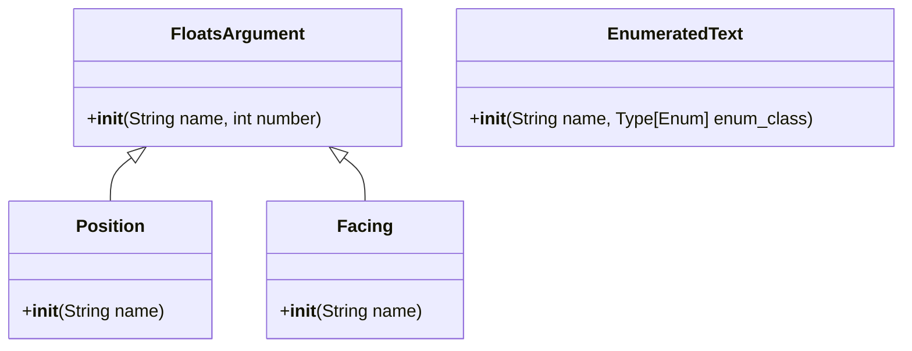

**English** | [中文](readme-zh_cn.md)

\>\>\> [Back to index](/readme.md)

## more_command_nodes

### Basic Information

- Plugin ID: `more_command_nodes`
- Plugin Name: MoreCommandNodes
- Version: None
  - Metadata version: 1.1.0
  - Release version: None
- Total downloads: 0
- Authors: [Andy Zhang](https://github.com/AnzhiZhang)
- Repository: https://github.com/AnzhiZhang/MCDReforgedPlugins
- Repository plugin page: https://github.com/AnzhiZhang/MCDReforgedPlugins/tree/master/more_command_nodes
- Labels: [`API`](/labels/api/readme.md)
- Description: More command nodes

### Dependencies

| Plugin ID | Requirement |
| --- | --- |
| [mcdreforged](https://github.com/Fallen-Breath/MCDReforged) | ^2.5 |

### Requirements

| Python package | Requirement |
| --- | --- |

### Introduction

# MoreCommandNodes

> 更多指令节点

如果您想要添加更多自定义节点，欢迎提交 PR！

## 节点列表

### FloatsArgument

连续的多个浮点数节点。

### Position

坐标节点，连续的三个浮点数。

### Facing

朝向节点，连续的两个浮点数。

### EnumeratedText

与 MCDR 的 Enumeration 类似，但是使用 Enum 的值而不是名称作为节点文本。

### Download

> :warning: Warning: Read the README file in plugin repository before using it.

| File | Version | Upload Time | Size | Downloads | Operations |
| --- | --- | --- | --- | --- | --- |

